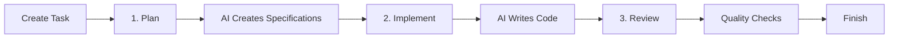

# Valksor Mehrhof - AI-Powered Development Assistant

[](https://github.com/valksor)
[](https://github.com/valksor/go-mehrhof/blob/master/LICENSE)
[](https://github.com/valksor/go-mehrhof/releases/latest)
[]() 
[![zread](https://img.shields.io/badge/Ask_Zread-_.svg?style=flat&color=00b0aa&labelColor=000000&logo=data%3Aimage%2Fsvg%2Bxml%3Bbase64%2CPHN2ZyB3aWR0aD0iMTYiIGhlaWdodD0iMTYiIHZpZXdCb3g9IjAgMCAxNiAxNiIgZmlsbD0ibm9uZSIgeG1sbnM9Imh0dHA6Ly93d3cudzMub3JnLzIwMDAvc3ZnIj4KPHBhdGggZD0iTTQuOTYxNTYgMS42MDAxSDIuMjQxNTZDMS44ODgxIDEuNjAwMSAxLjYwMTU2IDEuODg2NjQgMS42MDE1NiAyLjI0MDFWNC45NjAxQzEuNjAxNTYgNS4zMTM1NiAxLjg4ODEgNS42MDAxIDIuMjQxNTYgNS42MDAxSDQuOTYxNTZDNS4zMTUwMiA1LjYwMDEgNS42MDE1NiA1LjMxMzU2IDUuNjAxNTYgNC45NjAxVjIuMjQwMUM1LjYwMTU2IDEuODg2NjQgNS4zMTUwMiAxLjYwMDEgNC45NjE1NiAxLjYwMDFaIiBmaWxsPSIjZmZmIi8%2BCjxwYXRoIGQ9Ik00Ljk2MTU2IDEwLjM5OTlIMi4yNDE1NkMxLjg4ODEgMTAuMzk5OSAxLjYwMTU2IDEwLjY4NjQgMS42MDE1NiAxMS4wMzk5VjEzLjc1OTlDMS42MDE1NiAxNC4xMTM0IDEuODg4MSAxNC4zOTk5IDIuMjQxNTYgMTQuMzk5OUg0Ljk2MTU2QzUuMzE1MDIgMTQuMzk5OSA1LjYwMTU2IDE0LjExMzQgNS42MDE1NiAxMy43NTk5VjExLjAzOTlDNS42MDE1NiAxMC42ODY0IDUuMzE1MDIgMTAuMzk5OSA0Ljk2MTU2IDEwLjM5OTlaIiBmaWxsPSIjZmZmIi8%2BCjxwYXRoIGQ9Ik0xMy43NTg0IDEuNjAwMUgxMS4wMzg0QzEwLjY4NSAxLjYwMDEgMTAuMzk4NCAxLjg4NjY0IDEwLjM5ODQgMi4yNDAxVjQuOTYwMUMxMC4zOTg0IDUuMzEzNTYgMTAuNjg1IDUuNjAwMSAxMS4wMzg0IDUuNjAwMUgxMy43NTg0QzE0LjExMTkgNS42MDAxIDE0LjM5ODQgNS4zMTM1NiAxNC4zOTg0IDQuOTYwMVYyLjI0MDFDMTQuMzk4NCAxLjg4NjY0IDE0LjExMTkgMS42MDAxIDEzLjc1ODQgMS42MDAxWiIgZmlsbD0iI2ZmZiIvPgo8cGF0aCBkPSJNNCAxMkwxMiA0TDQgMTJaIiBmaWxsPSIjZmZmIi8%2BCjxwYXRoIGQ9Ik00IDEyTDEyIDQiIHN0cm9rZT0iI2ZmZiIgc3Ryb2tlLXdpZHRoPSIxLjUiIHN0cm9rZS1saW5lY2FwPSJyb3VuZCIvPgo8L3N2Zz4K&logoColor=ffffff)](https://zread.ai/valksor/go-mehrhof)

[](https://coveralls.io/github/valksor/go-mehrhof?branch=master)
[](https://goreportcard.com/report/github.com/valksor/go-mehrhof)


---

**⚠️ EXPERIMENTAL INTEGRATIONS**

Mehrhof's core workflow engine is stable, but **provider and agent integrations with third-party services are experimental**.

Due to the large number of external APIs (GitHub, GitLab, Jira, Notion, Claude, Gemini, etc.), integrations may:
- Break without notice due to third-party API changes
- Have edge cases not covered by automated tests
- Require manual validation for production use

We are gradually testing and hardening integrations. Report issues at [github.com/valksor/go-mehrhof/issues](https://github.com/valksor/go-mehrhof/issues).

---

## Why Mehrhof?

Mehrhof is an AI-powered development assistant that helps you plan, implement, and review code changes through an intuitive Web UI or command-line interface.

**Key benefits:**
- **Parallel tasks** - Run multiple AI tasks simultaneously using git worktrees for isolated development
- **Workflow engine** - Reliable plan → implement → review → finish cycle with checkpointing and undo/redo
- **Provider integrations** - Connect to 16+ task sources (Empty, Files, GitHub issues, Jira, Linear, Notion, etc.)
- **Browser automation** - Chrome automation for web testing, scraping, and authentication flows
- **MCP server** - Expose commands and workspace data to AI agents via Model Context Protocol
- **Semantic memory** - Store and search past tasks using vector embeddings for context-aware AI
- **Security scanning** - Integrated SAST (gosec), secret detection (gitleaks), and vulnerability scanning (govulncheck) with automatic tool downloading and caching
- **Multi-agent orchestration** - Run multiple agents in parallel, sequentially, or consensus modes
- **ML predictions** - Predict task complexity and resource requirements from historical data
- **State tracking** - Task state persists across sessions; resume anytime with `mehr continue`
- **Auto mode** - Fully automated workflow: `mehr auto file:task.md` handles everything
- **Prompt optimization** - Automatically refine prompts for clarity and effectiveness with `--optimize`
- **Self-updating** - Auto-update from GitHub releases, no manual reinstall

## Quick Start with Web UI

The fastest way to get started - **no command-line expertise required!**

### 3 Steps to Your First Task

```bash
# 1. Install Mehrhof (one command)
curl -fsSL https://raw.githubusercontent.com/valksor/go-mehrhof/master/install.sh | bash

# 2. Navigate to your project
cd /path/to/your/project

# 3. Start the Web UI
mehr init           # One-time setup
mehr serve --open   # Opens browser automatically
```

Click **"Create Task"** in your browser and you're ready to go!

### How It Works: Plan → Implement → Review

Mehrhof separates work into three phases. This gives you control over each step:



**Phase 1: Plan** - Click "Plan" to create specifications. The AI analyzes your codebase and creates a detailed blueprint. Review this before any code is written.

**Phase 2: Implement** - Click "Implement" to execute the specifications. The AI writes code following the plan.

**Phase 3: Review** - Click "Review" to run quality checks, then "Finish" to merge your changes.

### Installation Options

**Install Script (Recommended):**
```bash
curl -fsSL https://raw.githubusercontent.com/valksor/go-mehrhof/master/install.sh | bash
```

**Pre-built Binary:**
```bash
# Download for your platform (macOS ARM64 example)
curl -L https://github.com/valksor/go-mehrhof/releases/latest/download/mehr-darwin-arm64 -o mehr
chmod +x mehr
sudo mv mehr /usr/local/bin/
```

**Build from Source:**
```bash
git clone https://github.com/valksor/go-mehrhof.git
cd go-mehrhof
make install
```

See [Installation Guide](https://valksor.com/docs/mehrhof/#/quickstart) for more options.

---

## Web UI Features

Everything you need to manage AI-powered development tasks from your browser:

| Feature | Description |
|---------|-------------|
| 📊 **Dashboard** | See all your tasks at a glance with real-time progress |
| 🤖 **AI Workflow** | Plan, implement, review, and finish tasks with one click |
| 📝 **Task Creation** | Write tasks directly in the browser or upload files |
| 📜 **Live Output** | Watch the AI think and work as it happens |
| 🔙 **Undo/Redo** | Easy checkpoint navigation - go back if something goes wrong |
| 💬 **Notes** | Add context for the AI at any point |
| ⚙️ **Settings** | Configure agents, providers, and workflow options |
| 🔍 **History** | Browse and search past tasks |
| 🌐 **Browser Automation** | Control Chrome for web testing (when enabled) |
| 🌓 **Dark Mode** | Toggle between light and dark themes |
| 📱 **Mobile Ready** | Full functionality on your phone or tablet |

### Starting the Server

```bash
# Basic start (opens browser automatically)
mehr serve --open

# Specify a port
mehr serve --port 3000

# Global mode - see all registered projects
mehr serve --global
```

By default, the server runs on `localhost` only and requires no authentication.

### Advanced Options

**Remote Access** (requires authentication):

```bash
# Set up authentication first
mehr serve auth add admin yourpassword

# Then start on all network interfaces
mehr serve --host 0.0.0.0 --port 8080
```

**Access via SSH Tunnel** (recommended for remote):

```bash
ssh -L 3000:localhost:3000 your-server.com
# Then open http://localhost:3000 in your browser
```

**[Full Web UI Documentation](https://valksor.com/docs/mehrhof/#/guides/web-ui-getting-started)** - Complete walkthrough with ASCII visualizations

---

---

## For CLI Users

Prefer the command line? Mehrhof's CLI offers the same features with scriptable automation.

### CLI Workflow

```
┌─────────────────────────────────────────────────────────────┐
│                                                             │
│  mehr init  →  mehr start  →  mehr plan  →                  │
│       ↓                                                    │
│  mehr simplify  ←  (at any stage to refine content)         │
│       ↓                                                    │
│  →  mehr implement  →  mehr review  →  mehr finish          │
│                                                             │
└─────────────────────────────────────────────────────────────┘
```

1. **Initialize** (`mehr init`) - Set up workspace (one-time)
2. **Start** (`mehr start`) - Begin a task; creates git branch automatically
3. **Plan** (`mehr plan`) - AI generates implementation specifications
4. **Simplify** (`mehr simplify`) - Refine content based on current state (optional)
5. **Implement** (`mehr implement`) - AI executes the specifications
6. **Review** (`mehr review`) - Run automated code review
7. **Finish** (`mehr finish`) - Merge changes and clean up

**Recovery commands:**
- `mehr continue` - Resume workflow, optionally auto-execute (`--auto`)
- `mehr undo` / `mehr redo` - Revert to previous checkpoint
- `mehr abandon` - Abandon task without merging
- `mehr simplify` - Auto-detects what to simplify (task input, specs, or code)

---

```
┌─────────────────────────────────────────────────────────────┐
│                                                             │
│  mehr init  →  mehr start  →  mehr plan  →                  │
│       ↓                                                    │
│  mehr simplify  ←  (at any stage to refine content)         │
│       ↓                                                    │
│  →  mehr implement  →  mehr review  →  mehr finish          │
│                                                             │
└─────────────────────────────────────────────────────────────┘
```

1. **Initialize** (`mehr init`) - Set up workspace (one-time)
2. **Start** (`mehr start`) - Begin a task; creates git branch automatically
3. **Plan** (`mehr plan`) - AI generates implementation specifications
4. **Simplify** (`mehr simplify`) - Refine content based on current state (optional)
5. **Implement** (`mehr implement`) - AI executes the specifications
6. **Review** (`mehr review`) - Run automated code review
7. **Finish** (`mehr finish`) - Merge changes and clean up

**Recovery commands**:
- `mehr continue` - Resume workflow, optionally auto-execute (`--auto`)
- `mehr undo` / `mehr redo` - Revert to previous checkpoint
- `mehr abandon` - Abandon task without merging
- `mehr simplify` - Auto-detects what to simplify (task input, specs, or code)

## Essential Commands

| Command | Description |
|---------|-------------|
| `mehr init` | Initialize workspace (creates `.mehrhof/config.yaml`; task data in `~/.valksor/mehrhof/`) |
| `mehr start <ref>` | Start task from file, directory, or provider |
| `mehr sync <task-id>` | Sync task from provider and generate delta specification if changed |
| `mehr auto <ref>` | Full automation: plan → implement → review → finish |
| `mehr plan` | Generate AI implementation specifications |
| `mehr implement` | Execute the specifications |
| `mehr simplify` | Refine content based on current workflow state (task input, specs, or code) |
| `mehr review` | Run automated code review |
| `mehr status` | Show full task details with workflow state diagram |
| `mehr guide` | What should I do next? (quick suggestion) |
| `mehr continue` | Resume work on task |
| `mehr finish` | Complete task and merge changes |
| `mehr list` | List all tasks with search, filter, and sort (`--search`, `--filter`, `--sort`, `--format`) |
| `mehr undo` / `mehr redo` | Navigate checkpoints |
| `mehr note <msg>` | Add notes for AI context |
| `mehr cost` | View token usage and costs with ASCII charts (`--chart`) |
| `mehr providers status` | Check provider health and connection status |
| `mehr config explain` | Trace agent resolution path for debugging |
| `mehr browser` | Browser automation commands (goto, screenshot, click, etc.) |
| `mehr mcp` | Start MCP server for AI agent integration |
| `mehr scan` | Run security scanners (SAST, secrets, dependencies) |
| `mehr serve` | Start web UI server (includes auth, register subcommands) |
| `mehr project plan` | Create task breakdown from source with dependencies |
| `mehr project submit` | Submit tasks to provider with dependencies |

**Tip:** Use command shortcuts for faster typing: `mehr gu` → `guide`, `mehr config:v` → `config validate`.

**See [CLI Reference](https://valksor.com/docs/mehrhof/#/cli/index) for all commands and flags.**

## Task Providers

Mehrhof supports 16+ task sources. Use provider schemes to load tasks:

> **Security**: Provider login commands (`mehr github login`, etc.) use secure password-style input. Tokens are masked with asterisks (`****`) when entered and never displayed in the terminal.

| Provider | Scheme | Example | Docs |
|----------|--------|---------|------|
| Empty | `empty:` | `empty:FEATURE-1` | [empty](https://valksor.com/docs/mehrhof/#/providers/empty) |
| File | `file:` | `file:task.md` | [file](https://valksor.com/docs/mehrhof/#/providers/file) |
| Directory | `dir:` | `dir:./tasks/` | [directory](https://valksor.com/docs/mehrhof/#/providers/directory) |
| GitHub | `github:` | `github:123` | [github](https://valksor.com/docs/mehrhof/#/providers/github) |
| GitLab | `gitlab:` | `gitlab:123` | [gitlab](https://valksor.com/docs/mehrhof/#/providers/gitlab) |
| Bitbucket | `bitbucket:` | `bitbucket:123` | [bitbucket](https://valksor.com/docs/mehrhof/#/providers/bitbucket) |
| Jira | `jira:` | `jira:PROJ-123` | [jira](https://valksor.com/docs/mehrhof/#/providers/jira) |
| Linear | `linear:` | `linear:ENG-123` | [linear](https://valksor.com/docs/mehrhof/#/providers/linear) |
| Asana | `asana:` | `asana:1234...` | [asana](https://valksor.com/docs/mehrhof/#/providers/asana) |
| ClickUp | `clickup:` | `clickup:abc123` | [clickup](https://valksor.com/docs/mehrhof/#/providers/clickup) |
| Azure DevOps | `azdo:` | `azdo:123` | [azure-devops](https://valksor.com/docs/mehrhof/#/providers/azure-devops) |
| Notion | `notion:` | `notion:<uuid>` | [notion](https://valksor.com/docs/mehrhof/#/providers/notion) |
| Trello | `trello:` | `trello:<id>` | [trello](https://valksor.com/docs/mehrhof/#/providers/trello) |
| Wrike | `wrike:` | `wrike:<id>` | [wrike](https://valksor.com/docs/mehrhof/#/providers/wrike) |
| YouTrack | `youtrack:` | `youtrack:ABC-123` | [youtrack](https://valksor.com/docs/mehrhof/#/providers/youtrack) |

**Default provider**: Configure in `.mehrhof/config.yaml` to use bare references:
```yaml
providers:
  default: file  # "mehr start task.md" works without "file:" prefix
```

## Project Planning with Dependencies

Plan multi-task projects with dependency tracking:

```bash
# Create task breakdown from specs
mehr project plan dir:/workspace/.final/ --title "Auth System"

# Plan from a provider task (fetches details from provider)
mehr project plan github:123 --title "From Issue"

# View tasks and dependencies
mehr project tasks --show-deps

# Let AI optimize task order based on dependencies
mehr project reorder --auto

# Submit to provider with dependencies
mehr project submit --provider wrike

# Auto-implement all tasks in order
mehr project start --auto
```

**Features:** Multiple source types (files, directories, providers), AI task ordering, and provider integration.

See [Project Planning documentation](https://valksor.com/docs/mehrhof/#/cli/project) for full workflow details and dependency support by provider.

## Parallel Tasks with Worktrees

A **git worktree** is a separate working directory linked to the same git repository, allowing you to work on multiple branches simultaneously without stashing.

Run multiple tasks simultaneously in isolated environments:

```bash
# Terminal 1
mehr start --worktree feature-a.md
cd ../project-worktrees/<task-id>
mehr plan && mehr implement

# Terminal 2 (from main repo)
mehr start --worktree feature-b.md
cd ../project-worktrees/<task-id>
mehr plan && mehr implement
```

Each worktree is an isolated git checkout. Mehrhof auto-detects which task you're working on based on your current directory.

## AI Agents

> **⚠️ Claude is the Primary Supported Agent**
>
> Mehrhof is designed and optimized for **Claude**. See AI Agents documentation for other options.

Mehrhof supports AI agent plugins for custom backends. The primary agent is **Claude**, which is fully integrated with Mehrhof's workflow engine.

| Agent | Description |
|-------|-------------|
| Claude | Primary agent via Claude CLI (recommended) |

**See [AI Agents documentation](https://valksor.com/docs/mehrhof/#/agents/index) for configuration and custom aliases.**

## Configuration

**Project-level** (`.mehrhof/config.yaml`):
```yaml
# Git integration
git:
  auto_commit: true
  commit_prefix: "[{key}]"
  branch_pattern: "{type}/{key}--{slug}"
  target_branch: "main"

# Agent configuration
agent:
  default: claude
  timeout: 300

# Default provider for bare references
providers:
  default: file

# Auto-update checks
update:
  enabled: true
  check_interval: 24  # hours
```

**Note**: Task data (specifications, sessions, notes) is stored in `~/.valksor/mehrhof/workspaces/<project-id>/` to keep project directories clean.

**See [Configuration Guide](https://valksor.com/docs/mehrhof/#/configuration/index) for all options including agent aliases, per-step agents, and provider settings.**

## Documentation

- 📖 [Full Documentation](https://valksor.com/docs/mehrhof)
- [Quickstart](https://valksor.com/docs/mehrhof/#/quickstart) - Install and first task in 5 minutes
- [Guides](https://valksor.com/docs/mehrhof/#/guides/first-task) - Step-by-step tutorials
- [Providers](https://valksor.com/docs/mehrhof/#/providers/index) - Task source integrations
- [AI Agents](https://valksor.com/docs/mehrhof/#/agents/index) - Agent configuration and aliases
- [CLI Reference](https://valksor.com/docs/mehrhof/#/cli/index) - All commands and flags
- [Configuration](https://valksor.com/docs/mehrhof/#/configuration/index) - Customize behavior
- [Concepts](https://valksor.com/docs/mehrhof/#/concepts/workflow) - Workflow, storage, architecture
- [Troubleshooting](https://valksor.com/docs/mehrhof/#/troubleshooting/index) - Common issues

## Development

```bash
make build        # Build binary to ./build/mehr
make install      # Install to $GOPATH/bin
make test         # Run tests with coverage
make coverage     # Generate coverage report
make quality      # Run golangci-lint + govulncheck
make fmt          # Format code (gofmt, goimports, gofumpt)
make tidy         # Tidy dependencies
make hooks        # Enable versioned git hooks
make lefthook     # Install pre-commit hooks (auto-format + lint)
```

**CI/CD**: PRs trigger lint/test/build via GitHub Actions. Releases use [GoReleaser](https://goreleaser.com/) with Cosign signing.

See [CONTRIBUTING.md](CONTRIBUTING.md) for development guidelines and PR review setup.

## Contributing

See [CONTRIBUTING.md](CONTRIBUTING.md) for development guidelines.

## License

By contributing to Mehrhof, you agree that your contributions will be licensed under the [BSD 3-Clause License](LICENSE).

