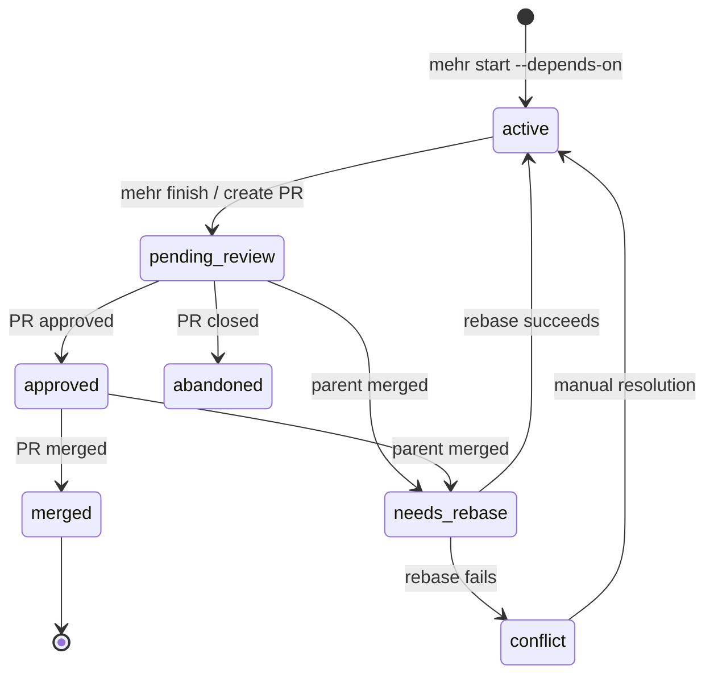

# Stacked Features

Manage dependent features when working on Feature B while Feature A is waiting on code review.

## Overview

Stacked features solve a common development problem: you've submitted Feature A for code review, but Feature B depends on it. Instead of waiting, you can:

1. Branch Feature B from Feature A's branch
2. Continue working while A is in review
3. When A merges, automatically rebase B onto the new target

This creates a "stack" of dependent features that Mehrhof tracks and manages.

## Key Concepts

### Stacks

A **stack** is a collection of related tasks with dependencies:

```
Stack: auth-system

    main
      │
      ├── feature/auth-system [issue-100] ✓ merged
      │     │
      │     └── feature/auth-oauth [issue-101] ⟳ needs-rebase
      │           │
      │           └── feature/auth-oauth-google [issue-102] ● active
```

Each stack has:
- **Root task**: The original feature (branches from main/target)
- **Dependent tasks**: Features that depend on others
- **Target branch**: The final merge target (usually `main`)

### Stack States

Tasks in a stack progress through states:

| State | Description |
|-------|-------------|
| `active` | Being worked on |
| `pending-review` | PR open, awaiting review |
| `approved` | PR approved, ready to merge |
| `merged` | PR merged to target |
| `needs-rebase` | Parent merged, needs rebasing |
| `conflict` | Rebase failed due to conflicts |
| `abandoned` | PR closed without merge |

### State Transitions



### Dependencies

Dependencies are tracked between tasks:

```yaml
# Example stack data
stacks:
  - id: "stack-abc123"
    root_task: "issue-100"
    tasks:
      - id: "issue-100"
        branch: "feature/auth-system"
        state: "merged"
        base_branch: "main"
      - id: "issue-101"
        branch: "feature/auth-oauth"
        state: "needs-rebase"
        depends_on: "issue-100"
      - id: "issue-102"
        branch: "feature/auth-oauth-google"
        state: "active"
        depends_on: "issue-101"
```

## Architecture

### Storage Model

Stacks are stored in the workspace data directory:

```
~/.valksor/mehrhof/workspaces/<project>/stacks/
└── index.yaml         # All stacks for this workspace
```

The storage uses:
- **Atomic writes**: Temp file + rename to prevent corruption
- **YAML format**: Human-readable and editable
- **Workspace scoping**: Each project has independent stacks

### Package Structure

```
internal/stack/
├── stack.go          # Core types (Stack, StackedTask, StackState)
├── storage.go        # YAML persistence with atomic writes
├── tracker.go        # PR status tracking and sync
└── rebase.go         # Rebase orchestration with conflict detection
```

### Key Types

```go
type Stack struct {
    ID        string        // Unique identifier
    RootTask  string        // First task in the stack
    Tasks     []StackedTask // All tasks in dependency order
    CreatedAt time.Time
    UpdatedAt time.Time
}

type StackedTask struct {
    ID         string     // Task reference (e.g., "issue-100")
    Branch     string     // Git branch name
    State      StackState // Current state
    PRNumber   int        // Associated PR number
    PRURL      string     // PR URL for quick access
    DependsOn  string     // Parent task ID
    BaseBranch string     // Original base branch
    MergedAt   *time.Time // When PR was merged
}

type StackState string

const (
    StateActive        StackState = "active"
    StatePendingReview StackState = "pending-review"
    StateApproved      StackState = "approved"
    StateMerged        StackState = "merged"
    StateNeedsRebase   StackState = "needs-rebase"
    StateConflict      StackState = "conflict"
    StateAbandoned     StackState = "abandoned"
)
```

## Rebase Strategy

### Topological Order

Tasks are rebased in topological order (parents before children):

```
Rebase order for stack auth-system:
1. issue-101 (depends on issue-100 which is merged → rebase onto main)
2. issue-102 (depends on issue-101 → rebase onto issue-101's branch)
```

This ensures:
- Parents are updated before children
- Children always have a valid base

### Target Branch Resolution

The rebase target is determined by the parent's state:

| Parent State | Rebase Target |
|--------------|---------------|
| `merged` | Stack's target branch (e.g., `main`) |
| `active`, `pending-review`, etc. | Parent's branch |

### Atomic Failure

If any task fails to rebase:
1. The operation immediately aborts
2. Git rebase is cleaned up (`git rebase --abort`)
3. No partial changes are committed
4. User is notified with conflict details

```go
// From internal/stack/rebase.go
if err := r.git.RebaseBranch(ctx, target); err != nil {
    // Abort the rebase to leave repo in clean state
    if abortErr := r.git.AbortRebase(ctx); abortErr != nil {
        slog.Warn("failed to abort rebase", "error", abortErr)
    }
    // Return with conflict information
    return &RebaseResult{
        FailedTask: &FailedTask{
            TaskID:       task.ID,
            Branch:       task.Branch,
            OntoBase:     target,
            IsConflict:   true,
            ConflictHint: err.Error(),
        },
    }, err
}
```

## PR Status Tracking

### Sync Mechanism

PR status is synced via provider integration:

1. Fetch PR details using provider's `FetchPR` capability
2. Compare current state with stored state
3. Update states (pending-review → merged, etc.)
4. Mark children as needs-rebase when parents merge

### Automatic vs Manual Sync

| Mode | Behavior |
|------|----------|
| **Manual** | Run `mehr stack sync` or click "Sync" in Web UI |
| **Auto** | Polling during `mehr auto` mode (configurable interval) |

## Integration Points

### With `mehr start`

Creating dependent features:

```bash
# Explicit dependency
mehr start issue-102 --depends-on issue-101

# Detected dependency (on feature branch)
mehr start issue-102
# Prompt: "You're on feature/auth-oauth (issue-101).
#          Does issue-102 depend on this? [Y/n]"
```

### With `mehr finish`

When finishing a task with PRs:
1. Task state updates to `pending-review`
2. PR number and URL are stored
3. Stack is updated

### With Provider

Uses provider capabilities:
- `CapFetchPR`: Get PR status (open, merged, closed)
- `CapFetchPRComments`: Get approval status (if supported)

## Relationship to Other Systems

### vs. TaskQueue

Mehrhof has two dependency systems:

| System | Purpose | When Used |
|--------|---------|-----------|
| **TaskQueue** | Plans tasks before provider submission | Project planning |
| **Stack** | Manages features already in progress | Active development |

TaskQueue handles "what to do next", Stack handles "what depends on what in git".

### vs. Links

Links create knowledge connections between entities. Stacks create git branch dependencies:

| System | Connection Type | Example |
|--------|----------------|---------|
| **Links** | Knowledge graph | `[[spec:1]]` references `[[spec:2]]` |
| **Stack** | Git dependencies | `feature/b` branches from `feature/a` |

Both can coexist: a task in a stack can have links to other specs.

## Best Practices

### Stack Depth

Keep stacks shallow (2-3 levels):

```
✅ Good: main → feature-a → feature-b
❌ Avoid: main → a → b → c → d → e (too deep)
```

Deep stacks:
- Increase rebase complexity
- Higher conflict probability
- Longer review cycles

### Atomic Features

Each task in a stack should be:
- **Independent**: Can be reviewed/merged alone
- **Coherent**: Makes sense as a single unit
- **Small**: Reasonable review size

### Early Merges

Merge parent features as soon as approved:
1. Reduces dependency chain
2. Simplifies rebases
3. Gets feedback faster

### Conflict Prevention

Minimize conflicts by:
- Separating concerns between dependent features
- Avoiding parallel changes to same files
- Communicating with team about file ownership

## Troubleshooting

### Conflict During Rebase

When rebase fails:

1. **Don't panic** - The repo is in a clean state (rebase was aborted)
2. **Check the conflict** - Note which files conflict
3. **Resolve manually**:
   ```bash
   git checkout feature/conflicting-branch
   git rebase target-branch
   # Resolve conflicts
   git rebase --continue
   ```
4. **Sync status** - Run `mehr stack sync` to update state

### Orphaned Tasks

If a task's parent is abandoned:
1. The task becomes orphaned in its stack
2. Options:
   - Rebase onto target branch directly
   - Abandon the dependent task
   - Create new independent feature

### PR Number Mismatch

If PR number doesn't match:
1. Run `mehr stack sync` to refresh
2. If still wrong, manually edit the stack data:
   ```bash
   vim ~/.valksor/mehrhof/workspaces/<project>/stacks/index.yaml
   ```

## See Also

- [CLI: stack](../cli/stack.md) - CLI commands
- [Web UI: Stack](../web-ui/stack.md) - Web UI usage
- [Configuration](../configuration/index.md) - Stack settings
