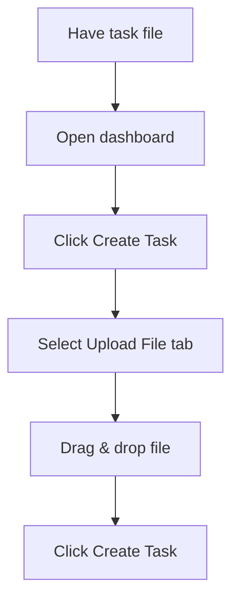
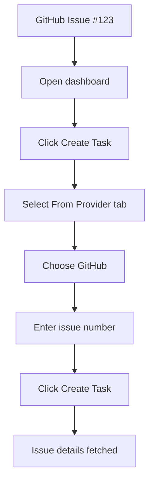
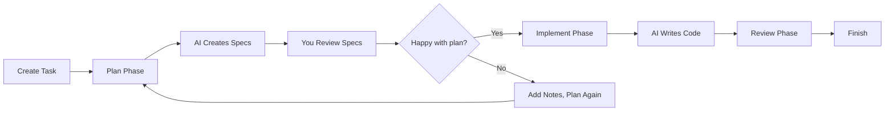
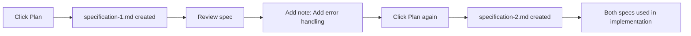
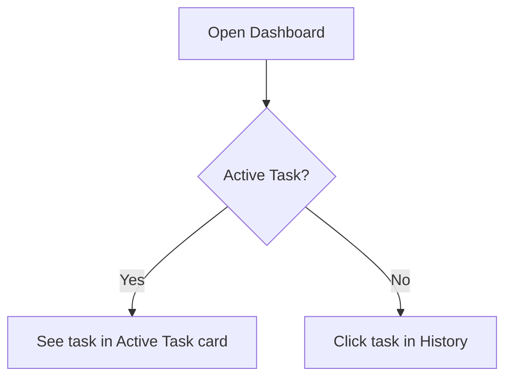
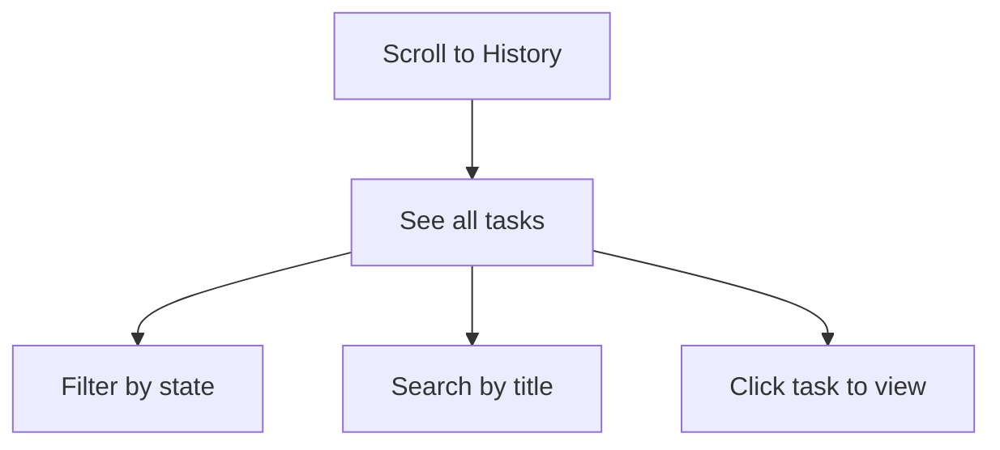
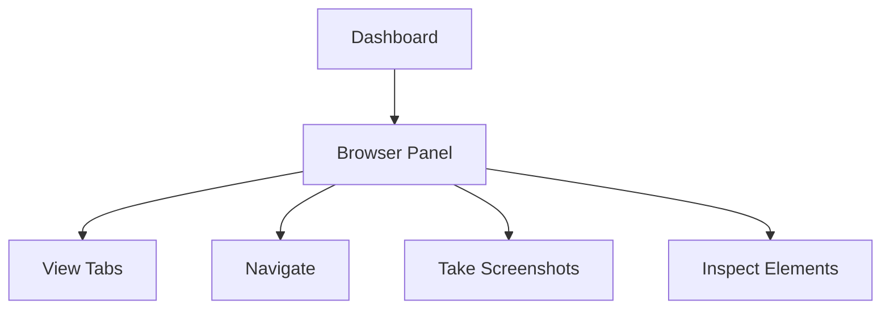
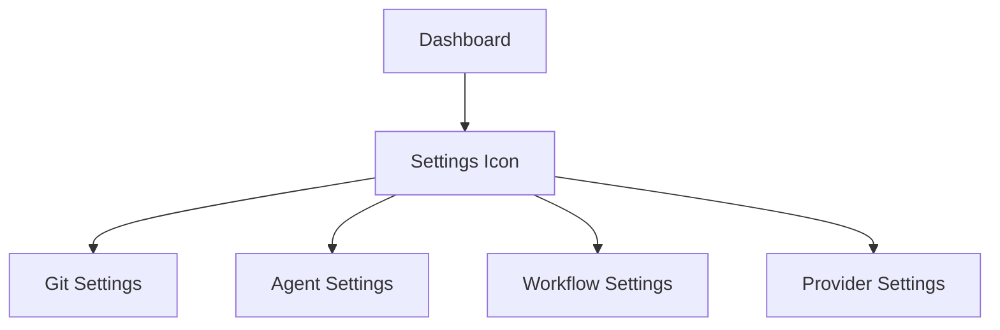
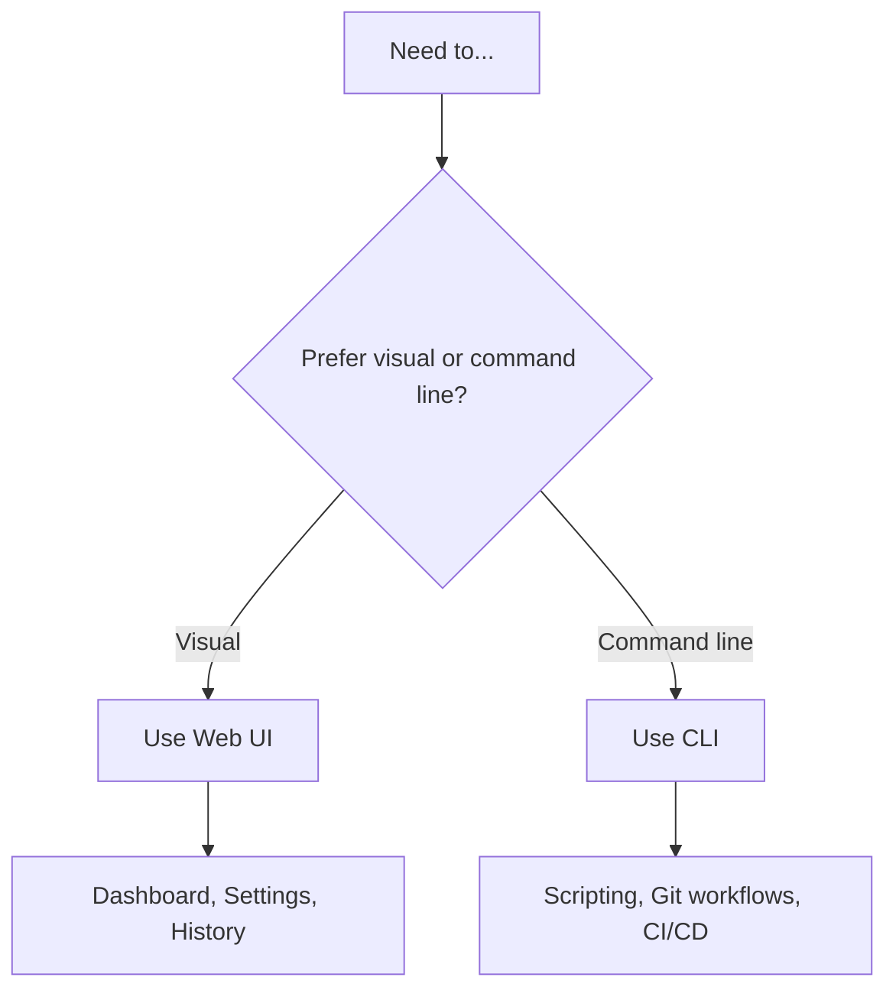

# Managing Tasks with the Web UI

Learn common workflows for managing tasks through the Web UI. This guide builds on the [Getting Started](web-ui-getting-started.md) tutorial.

## Workflows Covered

- Creating a task from a file
- Creating a task from a GitHub issue
- Continuing work on a task
- Reviewing task history
- Using the browser automation panel

---

## Creating a Task from a File

If you have an existing task description file (markdown, text, etc.):



**Step-by-step:**

1. Start the Web UI: `mehr serve --open`
2. Click **"Create Task"**
3. Click the **"Upload File"** tab
4. Drag and drop your file (or click to browse)
5. Click **"Create Task"**

**[Screenshot: Upload file dialog with drag-drop zone]**

### Supported File Types

| Format | Description | Example |
|--------|-------------|---------|
| `.md` | Markdown with frontmatter | `task.md` |
| `.txt` | Plain text description | `task.txt` |
| No extension | Text file | `TASK` |

### File Format Example

Your task file should look like this:

````markdown
---
title: Add user authentication
---

Implement OAuth2 login with Google.

## Requirements

- Use Google OAuth2 provider
- Store user sessions in the database
- Add logout functionality

## Endpoints

- GET /auth/login - Redirect to Google
- GET /auth/callback - Handle OAuth callback
- POST /auth/logout - Clear session
````

---

## Creating a Task from a GitHub Issue

Pull tasks directly from GitHub (or other providers) without leaving the browser.



**Step-by-step:**

1. Make sure you're logged in to GitHub:
   ```bash
   mehr github login
   ```
2. Start the Web UI: `mehr serve --open`
3. Click **"Create Task"**
4. Click the **"From Provider"** tab
5. Select **"GitHub"** from the dropdown
6. Enter the issue number (e.g., `123`)
7. Click **"Create Task"**

Mehrhof will fetch the issue title, description, and comments automatically.

**[Screenshot: Provider dialog with GitHub selected and issue number input]**

### Supported Providers

| Provider | Setup Command |
|----------|---------------|
| GitHub | `mehr github login` |
| GitLab | `mehr gitlab login` |
| Jira | `mehr jira configure` |
| Linear | `mehr linear configure` |
| Notion | `mehr notion configure` |
| Trello | `mehr trello configure` |

See [Providers](../providers/index.md) for complete setup instructions.

---

## The Planning Workflow

Understanding how planning works helps you get better results from the AI. Planning and implementation are separate phases—this gives you control over the process.



### Planning vs Implementation

| Phase | Purpose | Output | Permissions |
|-------|---------|--------|-------------|
| **Planning** | Create specifications | Markdown spec files | Read-only |
| **Implementation** | Execute specifications | Code files | Read/write |

**Key distinction:** During planning, the AI only *reads* your codebase to understand it. During implementation, the AI *writes* and *modifies* files.

### Planning Best Practices

1. **Be specific** - Detailed requirements produce better specs
2. **Add notes** - Use the Notes section to add context
3. **Review specs** - Always review before implementing
4. **Iterate** - Create multiple specs if needed

### Iterative Planning

You can run planning multiple times to build on existing specifications:



1. Click **"Plan"** → Creates `specification-1.md`
2. Review the spec
3. Add a note: "Also add error handling"
4. Click **"Plan"** again → Creates `specification-2.md`

Both specifications will be used during implementation. Each new spec builds on the previous ones.

### What Makes a Good Task Description?

The AI can only plan based on what you provide. Better inputs = better outputs:

**Good:**
````markdown
---
title: Add user authentication
---

Add OAuth2 login using Google as the provider.

## Requirements
- Use the existing OAuth2 library we already depend on
- Store user sessions in PostgreSQL
- Add logout functionality

## Endpoints to create
- GET /auth/login - Redirect to Google OAuth
- GET /auth/callback - Handle OAuth return
- POST /auth/logout - Clear session cookie
````

**Vague:**
```
Add login
```

### When to Re-Plan

**Re-plan if:**
- Requirements changed
- First plan missed important details
- AI misunderstood your request
- You thought of new features

**Don't re-plan if:**
- Just need to tweak implementation details (add a note instead)
- Plan looks correct but incomplete (add a note with "also add X")

---

## Continuing Work on a Task

When you return to a task later, the Web UI remembers exactly where you left off.

### Finding Your Active Task

The **Active Task** card at the top of the dashboard always shows your current task:



**[Screenshot: Active task card showing current state]**

### Resuming Workflow

1. Look at the **State** badge (e.g., "Planning", "Implementing", "Idle")
2. Click **"Continue"** to automatically run the next step
3. Or click a specific button: Plan, Implement, Review, etc.

### Example: Resuming After Planning

If your task is in the **"Idle"** state after planning:

1. Review the specifications in the **Specifications** section
2. Add any notes if needed
3. Click **"Implement"** to continue

**[Screenshot: Task in Idle state with specifications visible]**

---

## Reviewing Task History

Browse all your past tasks from the **Task History** section.



**[Screenshot: Task history section with filter and search controls]**

### Features

| Feature | How to Use |
|---------|------------|
| **Search** | Type in the search box to filter by title |
| **Filter** | Click filter buttons: All, Active, Completed, Failed |
| **View Details** | Click any task card to see full details |
| **Resume** | Click "Load" on a past task to make it active again |

### Task Card Information

Each task card shows:

```
┌─────────────────────────────────────┐
│ 📋 Add user authentication          │
│                                     │
│ State: Done         Branch: main    │
│ Created: 2 hours ago               │
│                                    │
│ [View Details]  [Load]             │
└─────────────────────────────────────┘
```

**[Screenshot: Task history card with labels]**

---

## Browser Automation Panel

When your task involves web testing or authentication, use the Browser Automation panel to control Chrome.



**[Screenshot: Browser automation panel with tab list and controls]**

### Starting the Browser

1. Make sure Chrome is running with remote debugging:
   ```bash
   google-chrome --remote-debugging-port=9222
   ```
2. The browser panel will automatically detect Chrome
3. You'll see a list of open tabs

### Controls

| Control | What It Does |
|---------|--------------|
| **Tabs List** | Shows all open Chrome tabs |
| **Refresh** | Reload the tab list |
| **Goto URL** | Navigate to a specific URL |
| **Screenshot** | Capture the current page |
| **Console** | Execute JavaScript |
| **DOM Query** | Inspect page elements |

### Example: Testing an Endpoint

1. Start your server locally
2. In the Browser panel, enter `http://localhost:8080/health`
3. Click **"Goto"**
4. Click **"Screenshot"** to capture the response

---

## Settings Management

Configure your workspace without editing YAML files directly.



**[Screenshot: Settings page with tab navigation]**

### Available Settings

| Section | What You Configure |
|---------|-------------------|
| **Git** | Auto-commit, branch patterns, target branch |
| **Agent** | Default agent, timeout, retries |
| **Workflow** | Session retention, cleanup options |
| **Browser** | Chrome port, headless mode |
| **Providers** | API tokens and connection details |

### Making Changes

1. Click the **Settings** icon (gear) in the top right
2. Select the section you want to configure
3. Make your changes
4. Click **"Save"**

Changes take effect immediately.

---

## Web UI vs CLI: When to Use Each



| Task | Web UI | CLI |
|------|--------|-----|
| Create task | ✅ Visual form | ✅ `mehr start` |
| Plan/Implement | ✅ One click | ✅ `mehr plan/implement` |
| View history | ✅ Visual cards | ✅ `mehr list` |
| Configure | ✅ Forms | ✅ Edit YAML |
| Automate | ❌ Not available | ✅ Scriptable |
| Screen share | ✅ Perfect | ❌ Hard to follow |

**[See: Web UI vs CLI Comparison](web-ui-vs-cli.md) for detailed breakdown**

---

## Tips and Tricks

### Keyboard Shortcuts

| Shortcut | Action |
|----------|--------|
| `Ctrl/Cmd + K` | Focus search (when available) |
| `Escape` | Close dialogs |
| `Ctrl/Cmd + /` | Toggle dark mode |

### Quick Actions

The dashboard's **Quick Actions** section provides context-aware buttons:

- **Continue**: Auto-runs the next logical step
- **Undo/Redo**: Navigate checkpoints quickly
- **Abandon**: Cancel the current task

### Cost Tracking

Monitor your API usage in the **Costs** section:

- Real-time token usage
- Estimated costs per task
- Charts showing spending over time

**[Screenshot: Cost tracking section with bar chart]**

---

## Troubleshooting

**Q: The Active Task card says "No active task"**
A: Go to Task History and click "Load" on a past task, or create a new task.

**Q: I don't see the Browser panel**
A: Browser automation requires Chrome with remote debugging enabled. See [Browser Configuration](../configuration/browser.md).

**Q: Settings changes aren't saving**
A: Make sure you click the "Save" button at the bottom of the settings form.

**Q: The page looks outdated**
A: Try refreshing your browser. The UI uses real-time updates, but a hard refresh (`Ctrl+Shift+R`) can help.

---

## Next Steps

- [**Web UI vs CLI**](web-ui-vs-cli.md) - Decide which interface to use
- [**Task Providers**](../providers/index.md) - Connect to external task sources
- [**Configuration**](../configuration/index.md) - Advanced configuration options
- [**Troubleshooting**](../troubleshooting/index.md) - Common issues and solutions
