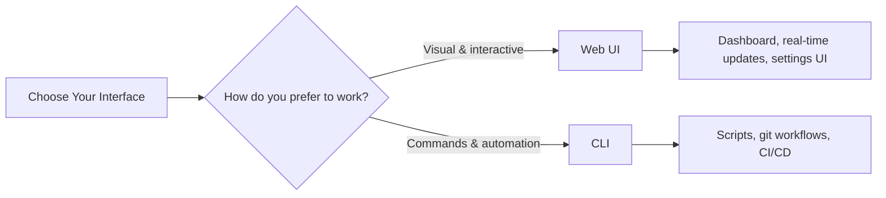
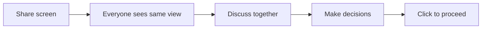
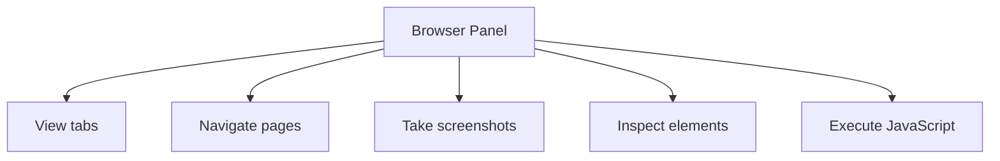
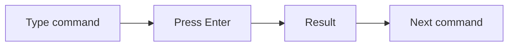
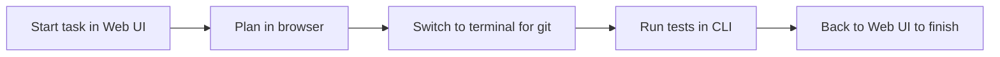
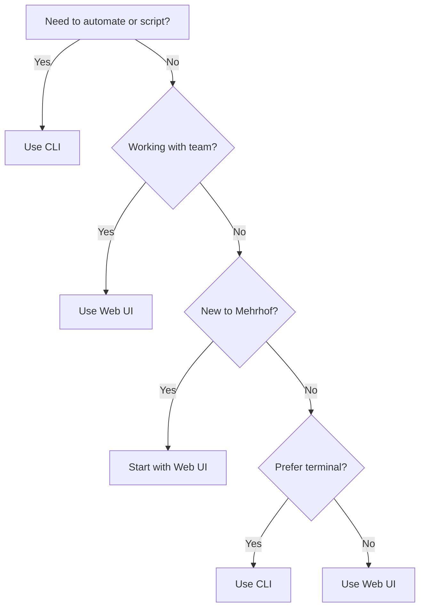

# Web UI vs CLI: Which Should You Use?

Mehrhof offers two ways to work: a graphical Web UI and a command-line interface (CLI). Both have the same features—choose based on your workflow and preferences.

## Quick Comparison



## At a Glance

| Aspect                   | Web UI                           | CLI                                 |
|--------------------------|----------------------------------|-------------------------------------|
| **Learning curve**       | Low - visual and intuitive       | Medium - requires command knowledge |
| **Speed (once learned)** | Medium - clicking and navigation | Fast - keyboard-driven              |
| **Visibility**           | See everything at once           | See what you ask for                |
| **Collaboration**        | Easy to screen-share             | Harder to share                     |
| **Automation**           | Manual only                      | Fully scriptable                    |
| **Remote access**        | Requires setup                   | Works over SSH naturally            |
| **Configuration**        | Visual forms                     | Edit YAML files                     |
| **Multi-task**           | Easy switching                   | Terminal per task                   |

---

## When to Use the Web UI

### Visual Learners

If you prefer seeing information laid out visually:

- **Dashboard** shows task state, progress, and options at a glance
- **Real-time streaming** of AI output as it happens
- **Visual state diagram** shows where you are in the workflow
- **File changes** displayed with color-coded diffs

### Team Collaboration

Perfect for pair programming and team reviews:



- Easy to screen-share during meetings
- Non-technical stakeholders can follow along
- Visual progress indicators keep everyone aligned

### Task Management

When you need to manage multiple tasks:

- **Task history** with search and filter
- **Quick switching** between past tasks
- **Cost tracking** with visual charts
- **Settings page** for easy configuration

### Browser Automation

The Web UI includes a dedicated browser control panel:



- Control Chrome for testing and scraping
- Visual tab management
- Screenshot capture
- DOM inspection

### Multi-Project Management

When working with multiple projects:

- **Global mode** (`mehr serve --global`) shows all registered projects
- **Project picker** to switch between projects
- **Unified settings** across projects

### New Users

If you're new to development tools:

- No need to memorize commands
- Visual cues guide you through workflows
- Buttons labeled with clear actions
- Helpful tooltips and descriptions

---

## When to Use the CLI

### Automation and Scripting

For repeatable workflows:

```bash
#!/bin/bash
# Automated task workflow
for task in tasks/*.md; do
  mehr auto "$task"
  mehr finish
done
```

- Script common workflows
- Integrate with other tools
- Run in CI/CD pipelines
- Batch process multiple tasks

### Git Workflows

If you live in the terminal:

```bash
git checkout -b feature/new-auth
mehr start task.md
mehr plan && mehr implement
git push origin feature/new-auth
```

- Seamless integration with git commands
- Branch workflows feel natural
- Commit messages generated automatically

### Speed and Efficiency

Once you know the commands:



- Keyboard-only operation
- Command completion with aliases
- Quick commands (`mehr pl`, `mehr impl`, `mehr fin`)
- No mouse needed

### Remote Servers

Working on remote machines:

```bash
ssh my-server.com
cd /app
mehr status
mehr continue
```

- Works naturally over SSH
- No browser needed on remote machine
- Lightweight terminal interface

### Power Users

If you prefer terminal workflows:

- Full control with flags and options
- Piping output to other tools
- Custom aliases and shortcuts
- Integration with shell scripts

---

## Feature Parity

Both interfaces have access to the same features:

| Feature          | Web UI                       | CLI                       |
|------------------|------------------------------|---------------------------|
| Start task       | ✅ Create button              | ✅ `mehr start`            |
| Plan             | ✅ Plan button                | ✅ `mehr plan`             |
| Implement        | ✅ Implement button           | ✅ `mehr implement`        |
| Review           | ✅ Review button              | ✅ `mehr review`           |
| Finish           | ✅ Finish button              | ✅ `mehr finish`           |
| Undo/Redo        | ✅ Buttons                    | ✅ `mehr undo/redo`        |
| View status      | ✅ Active Task card           | ✅ `mehr status`           |
| Workflow diagram | ✅ Interactive SVG            | ✅ `mehr status --diagram` |
| Add notes        | ✅ Note button                | ✅ `mehr note`             |
| Task history     | ✅ History section            | ✅ `mehr list`             |
| Cost tracking    | ✅ Costs section              | ✅ `mehr cost`             |
| Settings         | ✅ Settings page              | ✅ Edit config files       |
| Agents info      | ✅ Settings (Agents tab)      | ✅ `mehr agents list`      |
| Providers info   | ✅ Settings (Providers tab)   | ✅ `mehr providers list`   |
| Provider health  | ✅ Settings (Provider Health) | ✅ `mehr providers status` |
| Provider login   | ✅ Settings form              | ✅ `mehr <provider> login` |

**You can switch between interfaces anytime**—they share the same state and data.

---

## Hybrid Approach: Use Both

You don't have to choose one exclusively. Many users mix both:



### Common Hybrid Patterns

| Pattern       | Web UI For           | CLI For                     |
|---------------|----------------------|-----------------------------|
| **Developer** | Planning, reviewing  | Implementing, git workflows |
| **Team Lead** | Dashboard, history   | Quick status checks         |
| **DevOps**    | Configuration        | CI/CD automation            |
| **Beginner**  | Everything initially | Gradual CLI adoption        |

### Seamless Switching

Start a task in the Web UI:

```bash
# Terminal 1: Start the server
mehr serve --open
# Browser: Create task, click Plan
```

Continue in the CLI:

```bash
# Terminal 2: Same directory
mehr status      # See the task you created in browser
mehr implement   # Continue from where you left off
```

Finish in the Web UI:

```bash
# Browser: Click Finish
```

---

## Decision Guide

Answer these questions to decide:



### Quick Decision Table

| Your Situation               | Recommendation        |
|------------------------------|-----------------------|
| First time using Mehrhof     | Start with **Web UI** |
| Need to show work to others  | Use **Web UI**        |
| Building automation/CI/CD    | Use **CLI**           |
| Working on remote server     | Use **CLI**           |
| Managing many tasks          | Use **Web UI**        |
| Love keyboard shortcuts      | Use **CLI**           |
| Want visual progress         | Use **Web UI**        |
| Integrating with other tools | Use **CLI**           |

---

## Getting Started

### New to Mehrhof?

Start with the **[Web UI Getting Started guide](/web-ui/getting-started.md)** to learn the basics visually.

### Already Comfortable with CLI?

Jump to the **[Your First Task](first-task.md)** CLI tutorial.

### Want to Learn Both?

1. Start with the Web UI to understand concepts
2. Gradually incorporate CLI commands for speed
3. Use whichever fits your current task

---

## Summary

| Choose Web UI if you want...   | Choose CLI if you want... |
|--------------------------------|---------------------------|
| Visual, interactive experience | Command-line power        |
| Easy collaboration             | Scriptability             |
| At-a-glance status             | Keyboard efficiency       |
| Integrated settings            | Git-native workflow       |
| Browser automation             | Remote server access      |
| Lower learning curve           | Faster once learned       |

**Remember:** Both interfaces share the same backend. You can switch anytime without losing your place.

---

## Further Reading

- [Web UI Getting Started](/web-ui/getting-started.md) - Step-by-step Web UI tutorial
- [Your First Task (CLI)](first-task.md) - Step-by-step CLI tutorial
- [Managing Tasks with Web UI](/web-ui/creating-tasks.md) - Advanced Web UI workflows
- [CLI Reference](/cli/index.md) - Complete command documentation
