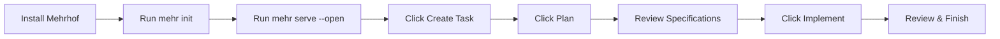

# Quickstart

Get started with Valksor Mehrhof in 5 minutes.

## Prerequisites

- **Git** - for version control integration
- **Claude CLI** - Mehrhof delegates AI operations to Claude ([setup guide](https://claude.com/product/claude-code))

```bash
claude --version
```

## Install

### Option 1: Install Script (Recommended)

```bash
# Latest stable release
curl -fsSL https://raw.githubusercontent.com/valksor/go-mehrhof/master/install.sh | bash

# Nightly build (latest master)
curl -fsSL https://raw.githubusercontent.com/valksor/go-mehrhof/master/install.sh | bash -s -- --nightly

# Specific version
curl -fsSL https://raw.githubusercontent.com/valksor/go-mehrhof/master/install.sh | bash -s -- -v v1.2.3
```

The script auto-detects your OS/architecture, verifies checksums, and installs to `~/.local/bin` (or `/usr/local/bin` with sudo).

> **Windows Users:** Use [WSL2](https://learn.microsoft.com/en-us/windows/wsl/) and run the install script from a Linux shell.

### Option 2: Pre-built Binary

| Platform | Architecture | Binary |
|----------|--------------|--------|
| Linux | AMD64 | `mehr-linux-amd64` |
| Linux | ARM64 | `mehr-linux-arm64` |
| macOS | Intel | `mehr-darwin-amd64` |
| macOS | Apple Silicon | `mehr-darwin-arm64` |

```bash
curl -L https://github.com/valksor/go-mehrhof/releases/latest/download/mehr-darwin-arm64 -o mehr
chmod +x mehr
sudo mv mehr /usr/local/bin/

mehr version
```

### Option 3: Nightly Build

Get the latest development build (use with caution):

```bash
curl -L https://github.com/valksor/go-mehrhof/releases/download/nightly/mehr-darwin-arm64 -o mehr
chmod +x mehr
sudo mv mehr /usr/local/bin/
```

### Option 4: Build from Source

Requires Go 1.25+:

```bash
git clone https://github.com/valksor/go-mehrhof.git
cd go-mehrhof

make install
mehr version
```

## Choose Your Interface

Mehrhof works two ways: through a **command-line interface (CLI)** or a **Web UI**. Both have full feature parity - choose what works best for you.

### Web UI (Recommended for Beginners)



**The planning phase creates specifications before any code is written.** This lets you review the AI's approach before implementation.

```bash
# 1. Initialize workspace (one-time per project)
mehr init

# 2. Start web UI and open browser
mehr serve --open

# 3. Click "Create Task" in your browser
```

**What you'll see:**
- A clean dashboard with your current task status
- Buttons to create, plan, implement, and finish tasks
- Real-time streaming of the AI's output
- Cost tracking and task history

**[Full Web UI Guide](web-ui/getting-started.md)** - Complete walkthrough with screenshots

### CLI (For Automation Enthusiasts)

```bash
# Create a task file
cat > task.md << 'EOF'
---
title: Add user authentication
---
Add login and signup pages with JWT tokens.
EOF

# Start the workflow
mehr start task.md
mehr plan
mehr implement
mehr finish
```

**[Full CLI Tutorial](guides/first-task.md)** - Step-by-step command-line guide

### Not Sure Which to Choose?

| Choose Web UI if you... | Choose CLI if you... |
|------------------------|---------------------|
| Prefer visual interfaces | Love terminal workflows |
| Want to see everything at once | Want to script automation |
| Are new to development | Work in CI/CD pipelines |
| Share tasks with a team | Use git-based workflows |

**[Web UI vs CLI Comparison](guides/web-ui-vs-cli.md)** - Detailed breakdown of when to use each

## Next: Your First Task

Now that Mehrhof is installed, follow the **[Your First Task Tutorial](guides/first-task.md)** to learn the workflow by building a complete feature.

## Common Commands

| Command | Description |
|---------|-------------|
| `mehr start <file>` | Start a task from markdown file |
| `mehr auto <file>` | Full automation (plan + implement + finish) |
| `mehr plan` | Generate AI implementation specifications |
| `mehr implement` | Execute the specifications |
| `mehr status` | Show current task status |
| `mehr continue` | Resume work with suggested actions |
| `mehr undo` / `mehr redo` | Navigate checkpoints |
| `mehr note "..."` | Add context for the AI |
| `mehr finish` | Complete and merge |
| `mehr abandon` | Discard task without merging |
| `mehr browser ...` | Browser automation |
| `mehr mcp` | MCP server for AI agents |

## Updating

```bash
mehr update
mehr update --check
```

## Learn More

- [Workflow Concepts](concepts/workflow.md) - Understanding the task lifecycle
- [CLI Reference](cli/index.md) - All commands and flags
- [Configuration](configuration/index.md) - Customize behavior
- [Task Providers](providers/index.md) - Load tasks from GitHub, Jira, Linear, etc.
