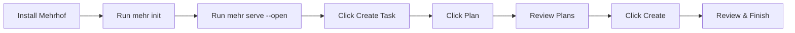

# Quickstart

Get started with Mehrhof in 5 minutes.

## What You'll Accomplish

By the end of this guide, you'll have:
1. Installed Mehrhof on your computer
2. Created your first task
3. Seen the plan → create → review workflow in action

No prior experience with command-line tools is required if you choose the Web UI path.

---

## Prerequisites

**Git** — Mehrhof uses Git for version control and checkpoints. [Install Git](https://git-scm.com/downloads) if you don't have it.

**Agent CLI** — Mehrhof orchestrates your local agent to handle text transformations. It does not provide AI access—you need an agent CLI installed separately. Claude is the recommended and primary-supported agent. **Already paying for Claude or another agent? Mehrhof is free—no extra cost.**

```bash
# Check if Claude is installed
claude --version
```

If you don't have Claude, follow the [Claude setup guide](https://claude.ai/code). For other agents, see [AI Agents](agents/index.md).

---

## Install Mehrhof

### Install Script (Recommended)

```bash
# Latest stable release
curl -fsSL https://raw.githubusercontent.com/valksor/go-mehrhof/master/install.sh | bash
```

The script auto-detects your OS and architecture, verifies checksums, and installs to `~/.local/bin` (or `/usr/local/bin` with sudo).

**Windows Users:** Use [WSL2](https://learn.microsoft.com/en-us/windows/wsl/) and run the installation script from a Linux shell.

### Other Installation Options

**Pre-built Binary:**
```bash
# macOS Apple Silicon example
curl -L https://github.com/valksor/go-mehrhof/releases/latest/download/mehr-darwin-arm64 -o mehr
chmod +x mehr
sudo mv mehr /usr/local/bin/
```

| Platform            | Binary              |
|---------------------|---------------------|
| macOS Intel         | `mehr-darwin-amd64` |
| macOS Apple Silicon | `mehr-darwin-arm64` |
| Linux AMD64         | `mehr-linux-amd64`  |
| Linux ARM64         | `mehr-linux-arm64`  |

**Build from Source** (requires Go 1.25+):
```bash
git clone https://github.com/valksor/go-mehrhof.git
cd go-mehrhof
make install
```

---

## Choose Your Interface

Mehrhof works two ways: through a **Web UI** or a **command-line interface (CLI)**. Both have full feature parity—choose what works best for you.

### Web UI — Comfortable Browser Experience

The Web UI is ideal if you prefer visual interfaces or are new to development tools. Everything happens in your browser with click-through workflows.



**Get started:**

```bash
# 1. Navigate to your project
cd /path/to/your/project

# 2. Initialize (one-time per project)
mehr init

# 3. Start the Web UI
mehr serve --open
```

Your browser opens automatically. Click **"Create Task"** to begin.

**What you'll see:**
- A clean dashboard showing your current task
- Buttons to create, plan, implement, and finish tasks
- Real-time streaming of progress
- Undo/redo controls if something goes wrong

**[Full Web UI Guide](web-ui/getting-started.md)** — Complete walkthrough with visual examples

---

### CLI — Power User Workflow

The CLI is ideal if you prefer text-based workflows, want to script automation, or work in CI/CD pipelines.

**Try it in 60 seconds:**

```bash
cd /path/to/your/project
mehr init

cat > task.md << 'EOF'
---
title: Add user authentication
---
Add login and signup pages with JWT tokens.
EOF

mehr start task.md
mehr plan
mehr implement
mehr finish
```

Want a pre-built task file? Grab one from the [examples directory on GitHub](https://github.com/valksor/go-mehrhof/tree/master/examples) — ready-to-use templates for features, bug fixes, and docs updates.

**[Full CLI Tutorial](guides/first-task.md)** — Step-by-step command-line guide

---

You can switch between Web UI and CLI at any time — both use the same engine and configuration. For a detailed comparison, see [Web UI vs CLI](guides/web-ui-vs-cli.md).

---

## Common Commands

| Command                   | What It Does                                |
|---------------------------|---------------------------------------------|
| `mehr init`               | Initialize workspace (one-time per project) |
| `mehr serve --open`       | Start Web UI and open browser               |
| `mehr start <file>`       | Begin a task from a description file        |
| `mehr plan`               | Generate a plan from your task              |
| `mehr implement`          | Execute the plan to create changes          |
| `mehr review`             | Run quality checks                          |
| `mehr finish`             | Complete and merge changes                  |
| `mehr status`             | Show current task state                     |
| `mehr undo` / `mehr redo` | Navigate checkpoints                        |
| `mehr note "..."`         | Add context for the workflow                |

---

## Updating

```bash
mehr update          # Update to latest version
mehr update --check  # Check for updates without installing
```

---

## Next Steps

- [Web UI Guide](web-ui/getting-started.md) — Visual walkthrough for comfortable browser use
- [Your First Task Tutorial](guides/first-task.md) — Detailed CLI guide
- [Workflow Concepts](concepts/workflow.md) — Understand the plan → create → review process
- [Configuration](configuration/index.md) — Customize behavior for your team
- [Providers](providers/index.md) — Pull tasks from GitHub, Jira, Linear, etc.
