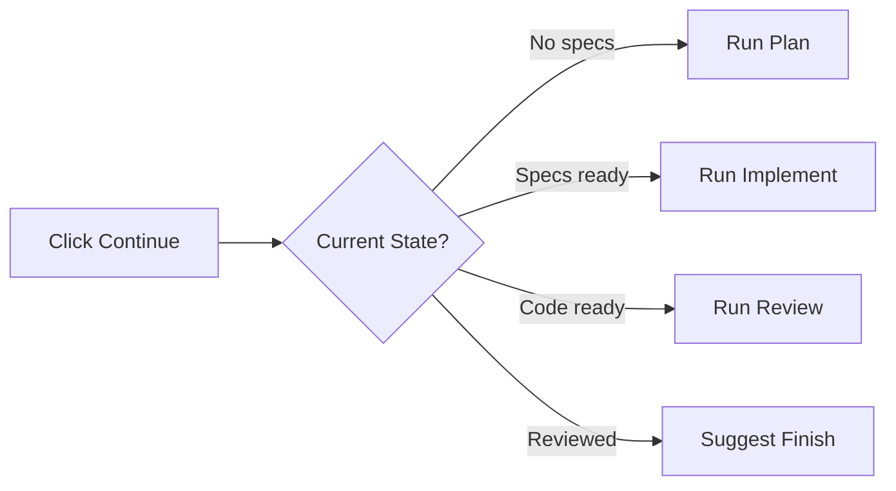

# Continuing

The continue action resumes work on a task and automatically executes the next logical step.

## What Continuing Does

When you click **"Continue"**, Mehrhof:

1. **Shows current status** - Displays task state and what's been done
2. **Suggests next action** - Recommends the logical next step
3. **Auto-executes (optional)** - With auto-mode, runs the next step automatically

## Starting Continue

Click the **"Continue"** button in the Quick Actions section:

```
┌──────────────────────────────────────────────────────────────┐
│  Quick Actions                                               │
├──────────────────────────────────────────────────────────────┤
│                                                              │
│  Task: Add User OAuth Authentication                         │
│  State: Idle                                                 │
│                                                              │
│  Suggestions:                                                │
│  • Click Plan to create specifications                        │
│  • Click Continue to auto-execute next step                  │
│                                                              │
│  [Continue] ← Click this button                              │
└──────────────────────────────────────────────────────────────┘
```

## Continue Workflow



## Context-Aware Suggestions

Continue analyzes your task state and suggests what to do next:

### After Starting (No Specifications)

```
┌──────────────────────────────────────────────────────────────┐
│  Continue Workflow                                           │
├──────────────────────────────────────────────────────────────┤
│                                                              │
│  Task: Add User OAuth Authentication                         │
│  State: Idle                                                 │
│                                                              │
│  No specifications yet.                                      │
│                                                              │
│  Suggested action:                                           │
│    📋 Create specifications using the Plan phase            │
│                                                              │
│  [Click Plan]  [Close]                                      │
└──────────────────────────────────────────────────────────────┘
```

### After Planning

```
┌──────────────────────────────────────────────────────────────┐
│  Continue Workflow                                           │
├──────────────────────────────────────────────────────────────┤
│                                                              │
│  Task: Add User OAuth Authentication                         │
│  State: Idle                                                 │
│  Specifications: 2 ready                                     │
│                                                              │
│  Specifications are ready for implementation.                │
│                                                              │
│  Suggested action:                                           │
│    🔨 Implement the specifications                           │
│                                                              │
│  [Click Implement]  [Close]                                 │
└──────────────────────────────────────────────────────────────┘
```

### After Implementation

```
┌──────────────────────────────────────────────────────────────┐
│  Continue Workflow                                           │
├──────────────────────────────────────────────────────────────┤
│                                                              │
│  Task: Add User OAuth Authentication                         │
│  State: Idle                                                 │
│  Changes: 5 files modified                                   │
│                                                              │
│  Code has been generated.                                    │
│                                                              │
│  Suggested actions:                                          │
│    🔍 Review changes with git diff                           │
│    🧪 Run automated code review                             │
│    ✅ Complete and merge task                                │
│                                                              │
│  [Review] [Finish] [Close]                                  │
└──────────────────────────────────────────────────────────────┘
```

## Auto-Execute Mode

For faster workflow, use auto-execute:

```
┌──────────────────────────────────────────────────────────────┐
│  Continue with Auto-Execute                                  │
├──────────────────────────────────────────────────────────────┤
│                                                              │
│  Auto-execute will run the next logical step automatically.  │
│                                                              │
│  Next step: Plan (create specifications)                     │
│                                                              │
│  [Continue with Auto]  [Close]                              │
└──────────────────────────────────────────────────────────────┘
```

With auto-execute, Mehrhof runs the next step without requiring another click.

## Use Cases

### Resuming Work

After stepping away from a task:

1. Open the dashboard
2. Click **"Continue"**
3. See what's next
4. Click the suggested action or let auto-execute handle it

### Quick Status Check

Use Continue for a faster status update than full status:

```
┌──────────────────────────────────────────────────────────────┐
│  Quick Status                                                 │
├──────────────────────────────────────────────────────────────┤
│                                                              │
│  Task: a1b2c3d4                                              │
│  Title: Add User OAuth Authentication                        │
│  State: Idle                                                 │
│  Branch: feature/user-oauth                                  │
│                                                              │
│  Ready for: Implement (specs created)                        │
│                                                              │
│  [Implement] [Close]                                        │
└──────────────────────────────────────────────────────────────┘
```

### Speed Through Workflow

For experienced users, use Continue with auto-execute to speed through the workflow:

1. Create task
2. Click Continue (auto-runs plan)
3. Click Continue (auto-runs implement)
4. Click Continue (auto-runs review)
5. Click Finish

## Continue vs Status

| Feature | Continue | Status |
|---------|----------|--------|
| **Speed** | Fast, minimal output | Full details |
| **Purpose** | Action-oriented | Information-oriented |
| **Suggestions** | Shows next action | Shows all available commands |
| **Best for** | Resuming work | Full inspection |

## Next Steps

After using Continue:

- [**Planning**](planning.md) - Create specifications
- [**Implementing**](implementing.md) - Execute specifications
- [**Reviewing**](reviewing.md) - Run quality checks
- [**Finishing**](finishing.md) - Complete the task

## CLI Equivalent

```bash
# See suggestions (no auto-execute)
mehr continue

# Auto-execute next step
mehr continue --auto

# Continue after a break
cd project
git checkout task/abc123
mehr continue
```

See [CLI: continue](../cli/continue.md) for all options.
