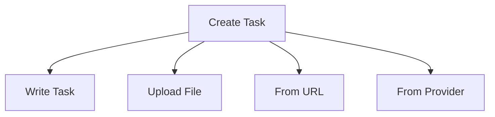

# Creating Tasks

Create tasks from scratch, upload files, or pull from external providers like GitHub, Jira, and Linear.

## The Create Task Dialog

Click **"Create Task"** on the dashboard to open the creation dialog. You'll see four tabs:



## Option 1: Write Task

Write your task description directly in the browser.

**Steps:**
1. Click **"Create Task"**
2. Select the **"Write Task"** tab
3. Enter a title and description
4. Click **"Create Task"**

```
┌─────────────────────────────────────────────────────────────┐
│  Create Task                                                 │
├─────────────────────────────────────────────────────────────┤
│  [Write Task] [Upload File] [From URL] [From Provider]      │
│  ─────────────────────────────────────────────────────────  │
│  Title: [_________________________________________________] │
│                                                              │
│  Description:                                                │
│  ┌────────────────────────────────────────────────────┐     │
│  │                                                    │     │
│  └────────────────────────────────────────────────────┘     │
│  Supports markdown formatting                               │
│                                                              │
│                                    [Create Task] [Cancel]   │
└─────────────────────────────────────────────────────────────┘
```

**Example task:**

````markdown
# Add User Authentication

Implement OAuth2 login with Google as the provider.

## Requirements
- Use the existing OAuth2 library
- Store user sessions in PostgreSQL
- Add logout functionality

## Endpoints
- GET /auth/login - Redirect to Google OAuth
- GET /auth/callback - Handle OAuth return
- POST /auth/logout - Clear session cookie
````

## Option 2: Upload File

Drag and drop an existing task file.

**Supported formats:**
- `.md` - Markdown with frontmatter
- `.txt` - Plain text description

**Steps:**
1. Click **"Create Task"**
2. Select the **"Upload File"** tab
3. Drag and drop your file (or click to browse)
4. Click **"Create Task"**

```
┌──────────────────────────────────────────────────────────────┐
│  Upload File                                                 │
├──────────────────────────────────────────────────────────────┤
│                                                              │
│              ┌─────────────────────────────────┐             │
│              │                                 │             │
│              │     Drag & drop file here       │             │
│              │     or click to browse          │             │
│              │                                 │             │
│              └─────────────────────────────────┘             │
│                                                              │
│  Supported: .md, .txt (max 5MB)                              │
│                                                              │
│                              [Cancel]         [Upload]       │
└──────────────────────────────────────────────────────────────┘
```

## Option 3: From URL

Fetch task description from a URL.

**Steps:**
1. Click **"Create Task"**
2. Select the **"From URL"** tab
3. Paste the URL
4. Click **"Create Task"**

## Option 4: From Provider

Pull tasks directly from external project management tools.

**Steps:**
1. Click **"Create Task"**
2. Select the **"From Provider"** tab
3. Choose your provider (GitHub, GitLab, Jira, etc.)
4. Enter the issue/ticket number
5. Click **"Create Task"**

```
┌──────────────────────────────────────────────────────────────┐
│  Create Task from Provider                                   │
├──────────────────────────────────────────────────────────────┤
│                                                              │
│  Provider: [GitHub ▼]                                        │
│                                                              │
│  Issue Number: [123________________]                          │
│                                                              │
│  ℹ️ Fetching from: github.com/valksor/go-mehrhof             │
│                                                              │
│                              [Cancel]         [Create Task]   │
└──────────────────────────────────────────────────────────────┘
```

### Supported Providers

| Provider | Setup Command            |
|----------|--------------------------|
| GitHub   | `mehr github login`      |
| GitLab   | `mehr gitlab login`      |
| Jira     | `mehr jira configure`    |
| Linear   | `mehr linear configure`  |
| Notion   | `mehr notion configure`  |
| Trello   | `mehr trello configure`  |
| Asana    | `mehr asana configure`   |
| ClickUp  | `mehr clickup configure` |

See [Providers](../providers/index.md) for complete setup instructions.

### GitHub Example

1. First, log in to GitHub:
   ```bash
   mehr github login
   ```

2. In the Web UI:
   - Select **"GitHub"** from the provider dropdown
   - Enter the issue number (e.g., `42`)
   - Click **"Create Task"**

Mehrhof automatically fetches:
- Issue title and description
- Labels (to infer task type)
- Comments
- Linked issues (`#123` references)

### Using Shorthands

Some providers support shorthand notation:

| Provider | Shorthand                   | Example    |
|----------|-----------------------------|------------|
| GitHub   | `gh`                        | `gh:42`    |
| GitLab   | `gl`                        | `gl:123`   |
| Jira     | None (requires project key) | `PROJ-123` |

## What Happens After Creating

Once you create a task:

1. **Task ID generated** - Unique 8-character identifier
2. **Git branch created** - Based on your branch pattern (e.g., `feature/add-user-auth`)
3. **Work directory initialized** - At `~/.valksor/mehrhof/workspaces/<project-id>/work/<id>/`
4. **Task set as active** - Appears in the Active Task card

```
┌──────────────────────────────────────────────────────────────┐
│  Active Task: Add User OAuth Authentication                   │
├──────────────────────────────────────────────────────────────┤
│  State: ● Idle                                                │
│  Branch: feature/user-oauth                                  │
│  Progress: ░░░░░░░░░░ 0%                                      │
│                                                              │
│  Last Action: "Task created" - just now                       │
│  Next Step: Plan                                              │
│                                                              │
│  [Continue] [Plan] [Implement] [Review] [Finish]             │
└──────────────────────────────────────────────────────────────┘
```

## Next Steps

After creating your task:

- [**Planning**](planning.md) - Generate implementation specifications
- [**Notes**](notes.md) - Add context before planning
- [**Dashboard**](dashboard.md) - Understand the full interface

## CLI Equivalent

```bash
# Write task from file
mehr start task.md

# From GitHub issue
mehr start github:123

# From directory
mehr start dir:./tasks/

# With custom key
mehr start --key JIRA-456 task.md
```

See [CLI: start](../cli/start.md) for all options.
