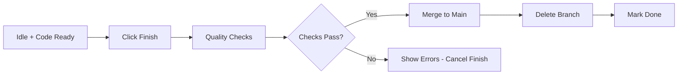

# Finishing

The finish phase completes your task and merges changes to the main branch.

## What Finishing Does

When you click **"Finish"**, Mehrhof:

1. **Runs quality checks** - Executes tests and quality tools (if configured)
2. **Squash-merges changes** - Merges your task branch to the target branch
3. **Deletes task branch** - Cleans up the feature branch
4. **Marks task complete** - Updates task state to "done"
5. **Cleans up work directory** - Optionally removes work files

## Starting Finish

When you're satisfied with the implementation, click **"Finish"** button:

```
┌──────────────────────────────────────────────────────────────┐
│  Active Task: Add User OAuth Authentication                  │
├──────────────────────────────────────────────────────────────┤
│  State: ● Idle                                               │
│  Changes: 5 files modified                                   │
│  Tests: ✅ All passing                                       │
│                                                              │
│  Actions:                                                    │
│    [Plan] [Implement] [Review] [Finish] [Continue]           │
│                                                              │
│  [Finish] ← Click this button                                │
└──────────────────────────────────────────────────────────────┘
```

## Finish Phase Workflow



## Finish Confirmation Dialog

Clicking **"Finish"** shows a confirmation dialog:

```
┌──────────────────────────────────────────────────────────────┐
│  ✓ Finish Task                                               │
├──────────────────────────────────────────────────────────────┤
│                                                              │
│  Task: Add User OAuth Authentication                         │
│  Status: Ready to finish                                     │
│                                                              │
│  Summary:                                                    │
│  • 3 files created                                           │
│  • 2 files modified                                          │
│  • 0 files deleted                                           │
│  • All tests passing                                         │
│                                                              │
│  What happens next:                                          │
│  ✓ Quality checks will run                                   │
│  ✓ Changes will merge to main branch                         │
│  ✓ Feature branch will be deleted                            │
│  ✓ Task will be marked complete                              │
│                                                              │
│  Target Branch: main                                         │
│  Merge Strategy: Squash merge                                │
│                                                              │
│                                    [Cancel] [Confirm Finish] │
└──────────────────────────────────────────────────────────────┘
```

## Quality Checks

Before merging, finish runs quality checks (if configured):

```
┌──────────────────────────────────────────────────────────────┐
│  Running Quality Checks...                                   │
├──────────────────────────────────────────────────────────────┤
│                                                              │
│  ▶ Running make test...                                      │
│  ✓ Tests passed (12/12)                                      │
│                                                              │
│  ▶ Running make quality...                                   │
│  ✓ Code formatted                                            │
│  ✓ No lint issues                                            │
│  ✓ Security checks passed                                    │
│                                                              │
│  All checks passed!                                          │
│                                                              │
│                                    [Continue]  [Cancel]      │
└──────────────────────────────────────────────────────────────┘
```

### When Checks Fail

If quality checks fail, finish is cancelled:

```
┌──────────────────────────────────────────────────────────────┐
│  ⚠️ Quality Checks Failed                                    │
├──────────────────────────────────────────────────────────────┤
│                                                              │
│  The following checks failed:                                │
│                                                              │
│  ✗ Tests: 2 failed                                           │
│    • TestAuthMiddleware - missing return                     │
│    • TestOAuthFlow - timeout                                 │
│                                                              │
│  ✗ Lint: 3 warnings                                          │
│    • missing-comments on exported functions                  │
│    • unused variable 'ctx'                                   │
│                                                              │
│  Fix issues and try again, or force finish.                  │
│                                                              │
│                    [Try Again]  [Force Finish]  [Cancel]     │
└──────────────────────────────────────────────────────────────┘
```

## Merge Behavior

The finish step uses **squash merge** by default:

1. **All commits combined** - Your task branch commits are squashed into one
2. **Single commit on target** - Clean history with one merge commit
3. **Branch deleted** - Task branch is removed after successful merge

### Commit Message

The squash merge uses a generated commit message:

```
Add user OAuth authentication

- Implemented Google OAuth2 provider
- Added session management with PostgreSQL
- Created login/logout endpoints
- Added authentication middleware

Co-authored-by: Claude Opus 4.5 <noreply@anthropic.com>
```

## After Finishing

Once finish completes:

```
┌──────────────────────────────────────────────────────────────┐
│  ✓ Task Completed                                            │
├──────────────────────────────────────────────────────────────┤
│                                                              │
│  Task: Add User OAuth Authentication                         │
│  State: Done                                                 │
│                                                              │
│  Summary:                                                    │
│  • Merged to main branch                                     │
│  • Branch feature/user-oauth deleted                         │
│  • Work directory cleaned up                                 │
│                                                              │
│  Commit: abc1234f (main branch)                              │
│                                                              │
│  [View in History]  [Create New Task]                        │
└──────────────────────────────────────────────────────────────┘
```

## Finish Options

Configure finish behavior in [Settings](settings.md):

| Option            | Description                         | Default   |
|-------------------|-------------------------------------|-----------|
| **Target branch** | Branch to merge into                | `main`    |
| **Delete branch** | Delete task branch after merge      | `true`    |
| **Delete work**   | Clean up work directory             | `false`   |
| **Run quality**   | Execute quality checks before merge | `true`    |
| **Commit prefix** | Template for commit message         | `[{key}]` |

## Finish Best Practices

1. **Review changes first** - Use git diff or the File Changes section
2. **Run tests locally** - Ensure tests pass before finishing
3. **Check quality** - Run quality tools manually if needed
4. **Verify merge** - Check the target branch after finish
5. **Keep work directory** - Don't delete if you need to reference specs later

## What Happens to Work Directory

By default, the work directory is preserved for reference. Configure cleanup in settings:

```yaml
workflow:
  delete_work_on_finish: false  # Keep work directory
  delete_work_on_abandon: false  # Keep on abandon too
```

To manually clean up old work directories, see your workspace location:

```
~/.valksor/mehrhof/workspaces/<project-id>/work/
```

## Next Steps

After finishing:

- [**Creating Tasks**](creating-tasks.md) - Start a new task
- [**Task History**](task-history.md) - View completed tasks
- [**Dashboard**](dashboard.md) - Return to main dashboard

## CLI Equivalent

```bash
# Finish task
mehr finish

# Finish without quality checks
mehr finish --no-quality

# Keep work directory
mehr finish --keep-work

# Specify target branch
mehr finish --target develop
```

See [CLI: finish](../cli/finish.md) for all options.
