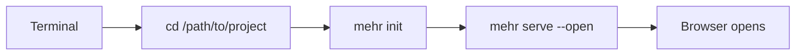
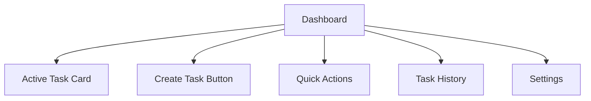
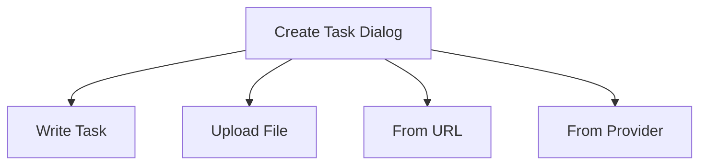
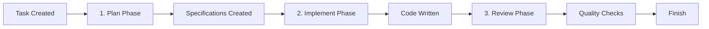
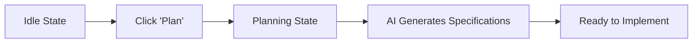
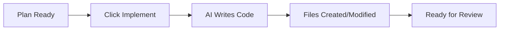
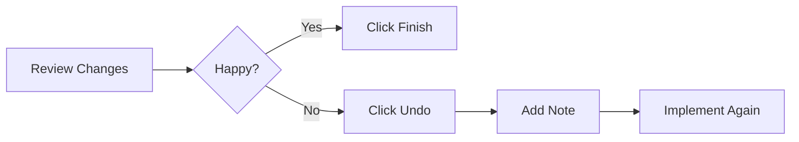

# Getting Started with the Web UI

Learn to use Mehrhof through the web interface - no command-line expertise required. This guide walks you through your first task from start to finish.

## What You'll Learn

By the end of this guide, you'll be able to:
- Start the Web UI server
- Create a task from scratch
- Watch the AI plan and implement
- Review and complete your task

## Prerequisites

- Mehrhof installed ([Quickstart](../quickstart.md) if needed)
- A project directory (can be empty or an existing codebase)
- Claude CLI configured with an API key

> **Don't have a project?** You can start with an empty directory. Mehrhof will create everything it needs.

---

## Step 1: Navigate to Your Project

Open your terminal and go to your project directory:

```bash
cd /path/to/your/project
```



> **Tip:** If you don't have a project yet, create one:
> ```bash
> mkdir my-project
> cd my-project
> ```

---

## Step 2: Initialize (First Time Only)

If this is your first time using Mehrhof in this project, run:

```bash
mehr init
```

You should see:

```
Initialized task workspace
Created: .mehrhof/ (configuration)
Updated: .gitignore
Note: Workspace data is stored in your home directory
```

This only needs to be done once per project.

---

## Step 3: Start the Web UI

Start the server and open your browser:

```bash
mehr serve --open
```

Your browser will open automatically to `http://localhost:XXXX`

> **If --open doesn't work:** Manually open your browser to the URL shown in the terminal (e.g., `http://localhost:54321`)

### What You'll See



```
┌─────────────────────────────────────────────────────────────────┐
│                     Mehrhof Dashboard                           │
│                                                                 │
│  ┌──────────────────────────────────────────────────────────┐  │
│  │  Active Task: No active task                             │  │
│  │                                                          │  │
│  │  [+ Create Task]                                         │  │
│  └──────────────────────────────────────────────────────────┘  │
│                                                                 │
│  ┌─────────────────┐  ┌─────────────────┐  ┌───────────────┐  │
│  │  Task History   │  │  Quick Actions  │  │   Settings    │  │
│  │  (empty)        │  │                 │  │               │  │
│  └─────────────────┘  └─────────────────┘  └───────────────┘  │
│                                                                 │
│  [Dark Mode Toggle]                                             │
└─────────────────────────────────────────────────────────────────┘
```

The dashboard has several sections:

| Section | What It Does |
|---------|--------------|
| **Active Task** | Shows your current task (or "No active task") |
| **Workflow Diagram** | Visual state machine showing current workflow state and valid transitions |
| **Quick Actions** | Buttons to continue, undo, redo |
| **Task History** | List of all past tasks |
| **Settings** | Configure agents, providers, and workflow |
| **Dark Mode Toggle** | Switch between light/dark theme (top right) |

### Workflow Diagram

At the top of the dashboard, you'll see an interactive workflow diagram that visualizes the current state:

```
┌──────────────────────────────────────────────────────────────┐
│  ┌─────┐    plan    ┌───────┐    implement    ┌─────────┐   │
│  │ IDLE│ ──────────>│PLANING│ ──────────────> │IMPLEMENT│   │
│  └─────┘             └───────│                  └────┬────┘   │
│    ▲                        │                      │         │
│    │                        │ finish              │ review  │
│    └────────────────────────┴──────────────────────┴─────────┤
│                         ◀── DONE ◀──                           │
└──────────────────────────────────────────────────────────────┘
```

- **Current state** is highlighted in color
- **Valid transitions** are shown as arrows
- The diagram updates automatically as the workflow progresses

This helps you understand where you are in the workflow and what actions are available.

---

## Step 4: Create Your First Task

Click the **"Create Task"** button in the center of the dashboard.

### The Create Task Dialog

You'll see a dialog with several options:



```
┌─────────────────────────────────────────────────────────────┐
│  Create Task                                                 │
├─────────────────────────────────────────────────────────────┤
│  [Write Task] [Upload File] [From URL] [From Provider]      │
│  ─────────────────────────────────────────────────────────  │
│  Title: [_________________________________________________] │
│                                                              │
│  Description:                                                │
│  ┌────────────────────────────────────────────────────┐     │
│  │                                                    │     │
│  └────────────────────────────────────────────────────┘     │
│                                                              │
│                                    [Create Task] [Cancel]   │
└─────────────────────────────────────────────────────────────┘
```

### Option A: Write a Task (Recommended for First Time)

1. Click the **"Write Task"** tab
2. Enter a title: `Add Health Check Endpoint`
3. Enter the description:

````markdown
Create a `/health` endpoint that:
- Returns HTTP 200 when healthy
- Responds with JSON including:
  - status: "ok"
  - timestamp: current time
  - version: "1.0.0"
````

4. Click **"Create Task"**

### Option B: Upload a File

1. Click the **"Upload File"** tab
2. Drag and drop a `.md` or `.txt` file
3. Click **"Create Task"**

### Option C: From GitHub (or Other Providers)

1. Click **"From Provider"**
2. Select "GitHub"
3. Enter issue number (e.g., `123`)
4. Click **"Create Task"**

---

## Understanding the Workflow: Plan, Implement, Review

Mehrhof works in three distinct phases. This separation gives you control over each step—you can review the plan before any code is written.



### The Planning Phase (Plan Mode)

When you click **"Plan"**, the AI analyzes your task and creates detailed specifications—think of it as a blueprint before building.

**What happens:**
- AI reads your task description
- Analyzes your existing codebase
- Creates specification files with implementation details
- May ask clarifying questions if something is unclear

**What you get:**
- One or more specification files (e.g., `specification-1.md`)
- A detailed plan the AI will follow during implementation
- Opportunity to review and adjust before code is written

**Why this matters:**
- You can review the plan before any code changes
- Catch misunderstandings early
- Iterate on the approach without touching code

### The Implementation Phase

When you click **"Implement"**, the AI executes the specifications:

**What happens:**
- AI reads all specification files
- Creates or modifies code files
- Writes tests
- Follows the plan from the planning phase

### The Review Phase

When you click **"Review"**, Mehrhof runs quality checks:

**What happens:**
- Runs automated tests (if configured)
- Checks code quality
- Reports any issues found

### Iterative Planning

You can run planning multiple times to build on existing specifications:

1. Click **"Plan"** → Creates `specification-1.md`
2. Review the spec
3. Add a note: "Also add error handling"
4. Click **"Plan"** again → Creates `specification-2.md`

Both specifications will be used during implementation.

---

## Step 5: Watch the Planning Phase

After creating your task, you'll see it appear in the **Active Task** card.



```
┌──────────────────────────────────────────────────────────────┐
│  Active Task: Add Health Check Endpoint                       │
├──────────────────────────────────────────────────────────────┤
│  State: ● Idle                                                │
│  Branch: feature/add-health-check                             │
│                                                              │
│  Actions:                                                    │
│    [Plan] [Implement] [Review] [Finish] [Continue]           │
│                                                              │
│  Cost: $0.12  |  Sessions: 1  |  Checkpoint: 3/5             │
└──────────────────────────────────────────────────────────────┘
```

1. Click the **"Plan"** button
2. Watch as the AI analyzes your requirements
3. The **Agent Output** section shows real-time progress
4. When complete, you'll see generated specifications

### Understanding the States

| State | What's Happening | What You Can Do |
|-------|------------------|-----------------|
| **Idle** | Task created, waiting for you | Click Plan, Implement, or Continue |
| **Planning** | AI is creating a plan | Watch the output |
| **Implementing** | AI is writing code | Watch the output |
| **Reviewing** | Code review is running | Check results |
| **Waiting** | AI has a question | Answer in the Questions section |
| **Done** | Task completed | Finish or review changes |

---

## Step 6: Review the Plan

After planning completes, you can review what the AI created:

1. Scroll to the **Specifications** section
2. Read through the implementation plan
3. If you want to change something, add a note

### Adding a Note (Optional)

Click the **"Add Note"** button and enter any clarifications:

```
Use our existing HTTP router pattern from main.go
```

This note will be included when the AI implements the task.

```
┌──────────────────────────────────────────────────────────────┐
│  Specifications                                              │
├──────────────────────────────────────────────────────────────┤
│                                                              │
│  📄 specification-1.md                                       │
│     # Implementation Plan: Add Health Check Endpoint         │
│                                                              │
│     ## Overview                                              │
│     Create a /health endpoint that returns HTTP 200...       │
│                                                              │
│     ## Files to Create                                       │
│     - internal/health/handler.go                             │
│     - internal/health/handler_test.go                        │
│                                                              │
│  [+ Add Note]  [View Full Content]                           │
└──────────────────────────────────────────────────────────────┘
```

---

## Step 7: Implement

When you're happy with the plan, click the **"Implement"** button.



Watch as the AI:
- Reads your specifications
- Analyzes your existing code
- Creates new files
- Modifies existing files
- Writes tests

### Real-Time Progress

The **Agent Output** section streams everything the AI does:

```
Analyzing codebase...
Reading specification 1...
Created: internal/health/handler.go
Modified: cmd/server/main.go
Created: internal/health/handler_test.go
```

```
┌──────────────────────────────────────────────────────────────┐
│  Agent Output (Live)                                          │
├──────────────────────────────────────────────────────────────┤
│  $ Analyzing codebase structure...                            │
│  $ Reading specification files...                             │
│  ✓ Found 3 specification files to process                     │
│                                                              │
│  → Creating internal/health/handler.go                        │
│    • Defined HealthHandler struct                             │
│    • Added ServeHTTP method                                   │
│  ✓ Created successfully                                       │
│                                                              │
│  → Modifying cmd/server/main.go                               │
│    • Registered /health route                                 │
│  ✓ Modified successfully                                      │
│                                                              │
│  → Creating internal/health/handler_test.go                   │
│    • Added TestHealthHandler                                  │
│  ✓ Created successfully                                       │
│                                                              │
│  ▶ Streaming... (scrolling updates in real-time)              │
└──────────────────────────────────────────────────────────────┘
```

---

## Step 8: Review Changes

After implementation completes, review what changed:

1. Scroll to **File Changes** section
2. See which files were created or modified
3. Click on files to see the actual changes (diff view)

```
┌──────────────────────────────────────────────────────────────┐
│  File Changes (3 files)                                       │
├──────────────────────────────────────────────────────────────┤
│                                                              │
│  ▼ internal/health/handler.go          [+ Created, 45 lines] │
│     │  + package health                                         │
│     │  +                                                        │
│     │  + type HealthHandler struct { ... }                      │
│     │  + func (h *HealthHandler) ServeHTTP(...)                │
│                                                              │
│  ▼ cmd/server/main.go                  [+ Modified, 3 lines] │
│     │  @@ -15,6 +15,9 @@                                        │
│     │           + "github.com/valksor/go-mehrhof/internal/health"│
│     │   ...                                                     │
│     │  +43:        mux.HandleFunc("/health", health.Handler)   │
│                                                              │
│  ▼ internal/health/handler_test.go      [+ Created, 32 lines]│
│     │  [expand to view tests...]                                 │
│                                                              │
└──────────────────────────────────────────────────────────────┘
```

### Not Happy With Something?

Use **Undo** to go back:

1. Click the **"Undo"** button
2. Add a note explaining what to fix
3. Click **"Implement"** again



---

## Step 9: Finish

When you're satisfied with the changes, click **"Finish"**.

This will:
- Run any quality checks (tests, linting)
- Merge your changes to the main branch
- Clean up the task branch
- Mark the task as complete

```
┌──────────────────────────────────────────────────────────────┐
│  ✓ Finish Task                                               │
├──────────────────────────────────────────────────────────────┤
│                                                              │
│  Task: Add Health Check Endpoint                             │
│  Status: Ready to finish                                     │
│                                                              │
│  Summary:                                                    │
│  • 3 files created                                           │
│  • 1 file modified                                           │
│  • 0 files deleted                                           │
│  • All tests passing                                         │
│                                                              │
│  What happens next:                                          │
│  ✓ Quality checks will run                                   │
│  ✓ Changes will merge to main branch                         │
│  ✓ Feature branch will be deleted                            │
│  ✓ Task will be marked complete                              │
│                                                              │
│                                    [Cancel] [Confirm Finish] │
└──────────────────────────────────────────────────────────────┘
```

---

## What Each Button Does

Quick reference for the main dashboard buttons:

| Button | What It Does | When to Use |
|--------|--------------|-------------|
| **Continue** | Auto-runs the next logical step | When you want to speed through |
| **Plan** | Generates implementation specifications | After creating a task |
| **Implement** | Writes code based on specifications | After planning completes |
| **Review** | Runs automated code review | After implementing |
| **Finish** | Completes and merges the task | When you're happy with changes |
| **Undo** | Goes back one checkpoint | When something goes wrong |
| **Redo** | Goes forward one checkpoint | After undoing, if you change your mind |
| **Abandon** | Discards the task entirely | When you want to cancel |

---

## Common First-Time Questions

**Q: Do I need to keep the terminal open?**
A: Yes, the server runs in that terminal. Closing it stops the web UI.

**Q: Can I use the Web UI on another computer?**
A: Yes, but you'll need to set up authentication. See [Remote Access](remote-access.md).

**Q: What if the AI makes a mistake?**
A: Use the **Undo** button, add a note explaining what went wrong, and implement again.

**Q: Can I switch between CLI and Web UI?**
A: Absolutely! They're fully compatible. You can start a task in the browser and continue from the terminal (or vice versa).

**Q: Where are my files stored?**
A: Your code stays in your project directory. Task data (specs, sessions) is stored in `~/.valksor/mehrhof/` to keep your project clean.

**Q: How do I stop the server?**
A: Press `Ctrl+C` in the terminal where `mehr serve` is running.

---

## Next Steps

Now that you've completed your first task:

- [**Creating Tasks**](creating-tasks.md) - Learn different task creation workflows
- [**Planning**](planning.md) - Deep dive into the planning phase
- [**Implementing**](implementing.md) - Understanding code generation
- [**Settings**](settings.md) - Configure agents, providers, and workflow
- [**Web UI vs CLI**](../guides/web-ui-vs-cli.md) - Understand when to use each interface
- [**Task Providers**](../providers/index.md) - Connect to GitHub, Jira, Linear, and more
