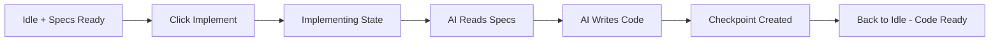
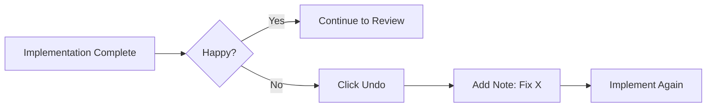

# Implementing

The implementation phase is where the AI executes your specifications and writes code.

## What Implementing Does

When you click **"Implement"**, the AI:

1. **Reads all specifications** - Every `specification-*.md` file is analyzed
2. **Analyzes existing code** - Understands your codebase structure and patterns
3. **Creates or modifies files** - Writes new code and updates existing files
4. **Writes tests** - Adds test coverage for new functionality
5. **Creates checkpoints** - Saves progress for undo/redo support

**Requirement:** At least one specification file must exist before implementing.

## Starting Implementation

After planning completes, and you've reviewed the specifications, click the **"Implement"** button:

```
┌──────────────────────────────────────────────────────────────┐
│  Active Task: Add User OAuth Authentication                   │
├──────────────────────────────────────────────────────────────┤
│  State: ● Idle                                                │
│  Specifications: 2 ready                                     │
│                                                              │
│  Actions:                                                    │
│    [Plan] [Implement] [Review] [Finish] [Continue]           │
│                                                              │
│  [Implement] ← Click this button                             │
└──────────────────────────────────────────────────────────────┘
```

## Implementation Phase Workflow



## Real-Time Progress

Watch the AI work in the **Agent Output** section:

```
┌──────────────────────────────────────────────────────────────┐
│  Agent Output (Live)                                          │
├──────────────────────────────────────────────────────────────┤
│  $ Reading specification files...                             │
│  ✓ Found 2 specification files to process                     │
│                                                              │
│  → Creating internal/auth/oauth.go                           │
│    • Defined OAuthConfig struct                              │
│    • Added GoogleProvider implementation                      │
│  ✓ Created successfully                                       │
│                                                              │
│  → Modifying internal/auth/middleware.go                     │
│    • Added AuthMiddleware function                           │
│    • Integrated session validation                           │
│  ✓ Modified successfully                                      │
│                                                              │
│  → Creating internal/auth/oauth_test.go                      │
│    • Added TestGoogleProvider                                │
│    • Added TestAuthMiddleware                               │
│  ✓ Created successfully                                       │
│                                                              │
│  ▶ Streaming... (scrolling updates in real-time)              │
└──────────────────────────────────────────────────────────────┘
```

## The Implementing State

During implementation, the task state changes to **"Implementing"**:

| State            | What's Happening        | What You Can Do                     |
|------------------|-------------------------|-------------------------------------|
| **Implementing** | AI is writing code      | Watch progress, wait for completion |
| **Waiting**      | AI has a question       | Answer in the Questions section     |
| **Idle**         | Implementation complete | Review changes, run tests           |

## Reviewing File Changes

After implementation completes, review what changed:

```
┌────────────────────────────────────────────────────────────────────┐
│  File Changes (5 files)                                            │
├────────────────────────────────────────────────────────────────────┤
│                                                                    │
│  ▼ internal/auth/oauth.go                 [+ Created, 87 lines]    │
│     │  + package auth                                              │
│     │  +                                                           │
│     │  + type OAuthConfig struct { ... }                           │
│     │  + func NewGoogleProvider(...)                               │
│     │  + func (p *GoogleProvider) RedirectURL(...)                 │
│                                                                    │
│  ▼ internal/auth/middleware.go             [+ Modified, 23 lines]  │
│     │  @@ -5,6 +5,10 @@                                            │
│     │     + "github.com/valksor/go-mehrhof/internal/auth"          │
│     │   ...                                                        │
│     │  +45:        func AuthMiddleware(...)                        │
│                                                                    │
│  ▼ internal/auth/oauth_test.go             [+ Created, 54 lines]   │
│     │  [expand to view tests...]                                   │
│                                                                    │
│  ▼ cmd/server/main.go                     [+ Modified, 8 lines]    │
│     │  [expand to view changes...]                                 │
│                                                                    │
│  ▼ go.lock                                  [+ Modified, 2 lines]  │
│     │  [expand to view dependencies...]                            │
│                                                                    │
└────────────────────────────────────────────────────────────────────┘
```

Click any file to see the full diff.

## Adding Notes Before Implementation

You can add notes right before implementing to provide additional guidance:

1. Click **"Add Note"** button
2. Enter instructions for the AI
3. Click **"Implement"**

```
Use the existing session store from internal/session/
Don't add Redis - we're using PostgreSQL only
```

The notes will be included in the implementation prompt.

## What If Something Goes Wrong?

### Use Undo

If you're not happy with the implementation:

1. Click **"Undo"** button
2. Add a note explaining what went wrong
3. Click **"Implement"** again



### Add Notes and Implement Again

Instead of reverting everything, you can:
1. Add a note with corrections
2. Click **"Implement"** again

The AI will build on the existing implementation and apply your corrections.

## Implementation Best Practices

1. **Review specs first** - Make sure specifications are complete
2. **Add context** - Use notes to guide the AI
3. **Check the output** - Review file changes after completion
4. **Run tests** - Verify everything works
5. **Use checkpoints** - Undo/redo if needed

## What Gets Implemented

The AI will create:
- **New files** - Based on specification requirements
- **Modifications** - Updates to existing files
- **Tests** - Unit tests for new functionality
- **Documentation** - Comments and docstrings

The AI follows your project's existing patterns and conventions.

## Next Steps

After implementation completes:

- [**Reviewing**](reviewing.md) - Run automated code review
- [**Finishing**](finishing.md) - Complete and merge the task
- [**Undo & Redo**](undo-redo.md) - Navigate checkpoints if needed
- [**Notes**](notes.md) - Add feedback for next iteration

## CLI Equivalent

```bash
# Run implementation
mehr implement

# Add a note first
mehr note "Use PostgreSQL, not Redis"
mehr implement

# Dry run to see what would happen
mehr implement --dry-run

# Continue after review
mehr continue
```

See [CLI: implement](../cli/implement.md) for all options.
