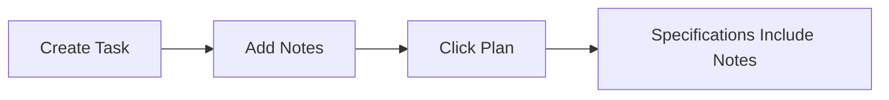

# Notes

Add notes to your task to provide context, requirements, and answers to agent questions.

## What Notes Do

Notes are saved to your task and included in all future AI interactions:
- **Planning prompts** - Notes help guide specification creation
- **Implementation prompts** - Notes guide code generation
- **Review prompts** - Notes inform quality checks
- **Question answers** - Q&A pairs are saved as notes

## Adding Notes

Click the **"Add Note"** button in the Active Task card:

```
┌──────────────────────────────────────────────────────────────┐
│  Active Task: Add User OAuth Authentication                  │
├──────────────────────────────────────────────────────────────┤
│  State: ● Idle                                               │
│                                                              │
│  [+ Add Note] ← Click this button                            │
│                                                              │
│  Notes (3)                                                   │
│  • "Use PostgreSQL for sessions"                             │
│  • "Add rate limiting"                                       │
│  • "JWT token should expire in 24h"                          │
└──────────────────────────────────────────────────────────────┘
```

## Add Note Dialog

```
┌──────────────────────────────────────────────────────────────┐
│  Add Note                                                    │
├──────────────────────────────────────────────────────────────┤
│                                                              │
│  Enter your note (markdown supported):                       │
│  ┌────────────────────────────────────────────────────┐      │
│  │                                                    │      │
│  └────────────────────────────────────────────────────┘      │
│                                                              │
│  This note will be included in the next planning or          │
│  implementation prompt.                                      │
│                                                              │
│                                    [Cancel] [Add Note]       │
└──────────────────────────────────────────────────────────────┘
```

## Types of Notes

### 1. Context Notes

Provide background information:

```
We're using the existing UserRepository from internal/users/
for all database operations. Don't create a new repository.
```

### 2. Requirements Notes

Add specific requirements:

```
The OAuth flow must support:
- Google as the primary provider
- State parameter to prevent CSRF
- PKCE for security
```

### 3. Constraint Notes

Specify constraints:

```
Do not add Redis - we're using PostgreSQL for session storage
to keep our infrastructure simple.
```

### 4. Answer Notes

Respond to agent questions:

```
Q: Which OAuth library should we use?
A: Use golang.org/x/oauth2 - it's already in our dependencies.
```

## Notes Workflow

### Before Planning

Add notes before planning to guide specification creation:



**Example:**
1. Create task: "Add user authentication"
2. Add note: "Use PostgreSQL for sessions"
3. Add note: "Support Google OAuth only"
4. Click **"Plan"**
5. Specifications include both requirements

### Before Implementation

Add notes before implementation to guide code generation:

```
┌──────────────────────────────────────────────────────────────┐
│  Specifications (2 ready)                                    │
├──────────────────────────────────────────────────────────────┤
│                                                              │
│  [+ Add Note]  Click before implementing                     │
│                                                              │
│  Note: Use the existing session store from                   │
│  internal/session/ - don't create a new one.                 │
│                                                              │
│  [Implement]                                                 │
└──────────────────────────────────────────────────────────────┘
```

### Answering Questions

When the AI asks a question during planning, use notes to answer:

```
┌──────────────────────────────────────────────────────────────┐
│  Question from Agent                                         │
├──────────────────────────────────────────────────────────────┤
│                                                              │
│  Should session tokens expire? If so, how long?              │
│                                                              │
│  [+ Add Note to Answer]                                      │
└──────────────────────────────────────────────────────────────┘
```

Click **"Add Note"** and provide your answer:

```
Yes, tokens should expire after 24 hours for security.
```

Then click **"Plan"** again to continue.

## Notes Storage

Notes are saved to `~/.valksor/mehrhof/workspaces/<project-id>/work/<id>/notes.md`:

```markdown
# Notes

## 2025-01-15 10:45:00 [idle]

Use PostgreSQL for session storage, not Redis.

## 2025-01-15 11:00:00 [idle]

Support Google OAuth only initially. Add other providers later.

## 2025-01-15 11:30:00 [waiting]

**Q:** Which OAuth library should we use?
**A:** Use golang.org/x/oauth2 - it's already in go.mod
```

## Viewing Notes

View all notes in the Active Task card:

```
┌──────────────────────────────────────────────────────────────┐
│  Notes (5)                                                   │
├──────────────────────────────────────────────────────────────┤
│                                                              │
│  📝 2025-01-15 11:30 - Answer to agent question              │
│     Use golang.org/x/oauth2 library                          │
│     [View] [Delete]                                          │
│                                                              │
│  📝 2025-01-15 11:00 - Planning context                      │
│     Support Google OAuth only initially                      │
│     [View] [Delete]                                          │
│                                                              │
│  📝 2025-01-15 10:45 - Storage preference                    │
│     Use PostgreSQL for sessions, not Redis                   │
│     [View] [Delete]                                          │
│                                                              │
│  [+ Add Note]                                                │
└──────────────────────────────────────────────────────────────┘
```

## Managing Notes

### Delete Notes

Click **"Delete"** next to any note to remove it.

### Edit Notes

To edit a note, delete it and add a new version.

### Note Priority

The most recent notes appear first and are included first in prompts.

## Notes Best Practices

1. **Be specific** - Clear notes produce better results
2. **Add early** - Notes before planning guide specifications
3. **Answer clearly** - Direct answers to questions
4. **Stay relevant** - Delete outdated notes
5. **Use markdown** - Format notes for readability

## Notes vs Task Description

| Feature      | Notes                       | Task Description     |
|--------------|-----------------------------|----------------------|
| **Purpose**  | Add context during workflow | Initial requirements |
| **Timing**   | Anytime                     | Before creation      |
| **Scope**    | Specific details            | Overall goal         |
| **Examples** | "Use existing patterns"     | "Add authentication" |

## Next Steps

After adding notes:

- [**Planning**](planning.md) - Run planning with notes included
- [**Implementing**](implementing.md) - Implement with notes
- [**Dashboard**](dashboard.md) - Return to main view

## CLI Equivalent

```bash
# Add a single note
mehr note "Use PostgreSQL for sessions"

# Interactive mode (multiple notes)
mehr note

# Answer a question
mehr answer "Use golang.org/x/oauth2"

# View notes
cat ~/.valksor/mehrhof/workspaces/<project-id>/work/<id>/notes.md
```

See [CLI: note](../cli/note.md) for details.
