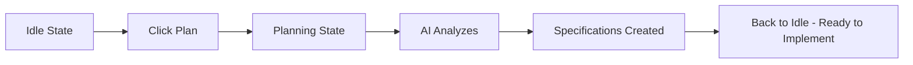
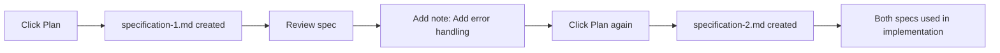

# Planning

The planning phase is where the AI analyzes your requirements and creates detailed specifications—a blueprint before any code is written.

## What Planning Does

When you click **"Plan"**, the AI:

1. **Reads your task description** - Understands requirements and constraints
2. **Analyzes your codebase** - Scans existing files to understand patterns and structure
3. **Creates specifications** - Writes detailed implementation plans
4. **May ask questions** - Requests clarification if something is unclear

**Key benefit:** You can review and adjust the plan before any code changes are made.

## Starting Planning

After creating a task, click the **"Plan"** button in the Active Task card:

```
┌──────────────────────────────────────────────────────────────┐
│  Active Task: Add User OAuth Authentication                  │
├──────────────────────────────────────────────────────────────┤
│  State: ● Idle                                               │
│  Branch: feature/user-oauth                                  │
│                                                              │
│  Actions:                                                    │
│    [Plan] [Implement] [Review] [Finish] [Continue]           │
│                                                              │
│  [Plan] ← Click this button                                  │
└──────────────────────────────────────────────────────────────┘
```

## Planning Phase Workflow



## Real-Time Progress

Watch the AI work in the **Agent Output** section:

```
┌──────────────────────────────────────────────────────────────┐
│  Agent Output (Live)                                         │
├──────────────────────────────────────────────────────────────┤
│  $ Reading task description...                               │
│  $ Analyzing codebase structure...                           │
│  ✓ Scanning internal/ directory                              │
│  ✓ Reviewing existing auth patterns                          │
│  $ Creating specification...                                 │
│  ✓ Generated specification-1.md                              │
│  ▶ Streaming...                                              │
└──────────────────────────────────────────────────────────────┘
```

## The Planning State

During planning, the task state changes to **"Planning"**:

| State        | What's Happening                   | What You Can Do                     |
|--------------|------------------------------------|-------------------------------------|
| **Planning** | AI is analyzing and creating specs | Watch progress, wait for completion |
| **Waiting**  | AI has a question                  | Answer in the Questions section     |
| **Idle**     | Planning complete, specs ready     | Review specs, proceed to implement  |

## Reviewing Specifications

After planning completes, review the generated specifications:

```
┌──────────────────────────────────────────────────────────────┐
│  Specifications (2 files)                                    │
├──────────────────────────────────────────────────────────────┤
│                                                              │
│  📄 specification-1.md                                       │
│     ✓ OAuth Provider Setup                                   │
│     ✓ Database Schema for Sessions                           │
│     ✓ Login/Logout Endpoints                                 │
│                                                              │
│  📄 specification-2.md                                       │
│     ✓ Token Validation Middleware                            │
│     ✓ Session Management                                     │
│     ✓ Security Considerations                                │
│                                                              │
│  [View Full Content] [+ Add another specification]           │
└──────────────────────────────────────────────────────────────┘
```

## Iterative Planning

You can run planning multiple times to build on existing specifications:



**Steps:**
1. Click **"Plan"** → Creates `specification-1.md`
2. Review the specification
3. Add a note: "Also add comprehensive error handling"
4. Click **"Plan"** again → Creates `specification-2.md`

Both specifications will be used during implementation. Each new spec builds on the previous ones.

## Adding Context Before Planning

Add notes to provide additional context before planning:

1. Click **"Add Note"** button
2. Enter your context or requirements

```
┌──────────────────────────────────────────────────────────────┐
│  Add Note                                                    │
├──────────────────────────────────────────────────────────────┤
│                                                              │
│  ┌────────────────────────────────────────────────────┐      │
│  │ Use the existing OAuth2 library from go-oauth2:    │      │
│  │ we already have this as a dependency.              │      │
│  │                                                    │      │
│  │ Sessions should be stored in PostgreSQL, not       │      │
│  │ Redis.                                             │      │
│  └────────────────────────────────────────────────────┘      │
│                                                              │
│                                    [Cancel] [Add Note]       │
└──────────────────────────────────────────────────────────────┘
```

## Answering Questions

If the AI needs clarification during planning, it will enter the **"Waiting"** state and show a question:

```
┌──────────────────────────────────────────────────────────────┐
│  Question from Agent                                         │
├──────────────────────────────────────────────────────────────┤
│                                                              │
│  Which OAuth2 library should we use for Google integration?  │
│                                                              │
│  Options:                                                    │
│    • go-oauth2/oauth2 (existing dependency)                  │
│    • golang.org/x/oauth2                                     │
│    • Other (specify)                                         │
│                                                              │
│  [Answer: go-oauth2/oauth2]  [Answer: golang.org/x/oauth2]   │
│  [Provide custom answer]                                     │
└──────────────────────────────────────────────────────────────┘
```

Use the **"Add Note"** button to answer, then click **"Plan"** again.

## What Makes a Good Task Description

The AI can only plan based on what you provide:

**Good:**
````markdown
---
title: Add user authentication
---

Add OAuth2 login using Google as the provider.

## Requirements
- Use the existing OAuth2 library we already depend on
- Store user sessions in PostgreSQL
- Add logout functionality

## Endpoints to create
- GET /auth/login - Redirect to Google OAuth
- GET /auth/callback - Handle OAuth return
- POST /auth/logout - Clear session cookie
````

**Vague:**
```
Add login
```

## Planning Best Practices

1. **Be specific** - Detailed requirements produce better specs
2. **Add notes** - Use the Notes section for additional context
3. **Review specs** - Always review before implementing
4. **Iterate** - Create multiple specs if needed
5. **Answer questions** - Provide clear responses when AI asks

## When to Re-Plan

**Re-plan if:**
- Requirements changed
- First plan missed important details
- AI misunderstood your request
- You thought of new features

**Don't re-plan if:**
- Just need to tweak implementation details (add a note instead)
- Plan looks correct but incomplete (add a note with "also add X")

## Next Steps

After planning completes:

- [**Implementing**](implementing.md) - Execute the specifications
- [**Notes**](notes.md) - Add more context before implementation
- [**Undo**](undo-redo.md) - Revert planning if needed

## CLI Equivalent

```bash
# Run planning
mehr plan

# Add notes first
mehr note "Use PostgreSQL, not Redis"
mehr plan

# Answer a question and continue
mehr answer "Use go-oauth2/oauth2"
mehr plan
```

See [CLI: plan](../cli/plan.md) for all options.
