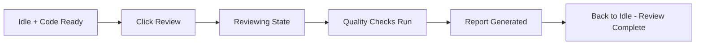

# Reviewing

The review phase runs automated quality checks on your code.

## What Reviewing Does

When you click **"Review"**, Mehrhof:

1. **Runs quality checks** - Executes configured quality tools (linters, formatters)
2. **Analyzes code** - Checks for common issues and patterns
3. **Generates report** - Creates a review summary with findings
4. **Saves review** - Stores results in the task's review directory

## Starting Review

After implementation completes, click the **"Review"** button:

```
┌──────────────────────────────────────────────────────────────┐
│  Active Task: Add User OAuth Authentication                  │
├──────────────────────────────────────────────────────────────┤
│  State: ● Idle                                               │
│  Changes: 5 files modified                                   │
│                                                              │
│  Actions:                                                    │
│    [Plan] [Implement] [Review] [Finish] [Continue]           │
│                                                              │
│  [Review] ← Click this button                                │
└──────────────────────────────────────────────────────────────┘
```

## Review Phase Workflow



## Real-Time Progress

Watch the review in the **Agent Output** section:

```
┌──────────────────────────────────────────────────────────────┐
│  Agent Output (Live)                                         │
├──────────────────────────────────────────────────────────────┤
│  $ Running quality checks...                                 │
│  ✓ golangci-lint - passed                                    │
│  ✓ go test - all tests passing                               │
│                                                              │
│  Review complete: No issues found                            │
│  ▶ Streaming...                                              │
└──────────────────────────────────────────────────────────────┘
```

## Configuring Quality Checks

Configure which linters run during review via **Settings** → **Quality**:

```
┌──────────────────────────────────────────────────────────────┐
│  Quality Settings                                            │
├──────────────────────────────────────────────────────────────┤
│                                                              │
│  Enable Quality Checks         [✓]                           │
│  Use Defaults                   [✗]  (Safer: require config) │
│                                                              │
│  Linters:                                                    │
│    ┌─────────────────────────────────────────────────────┐   │
│    │ golangci-lint        [Enabled: ✓]  [Run]            │   │
│    │ eslint               [Enabled: ✗]  [Disabled]       │   │
│    │ phpstan              [Enabled: ✓]  [Custom]         │   │
│    │   Command: vendor/bin/phpstan analyse               │   │
│    └─────────────────────────────────────────────────────┘   │
│                                                              │
│  [Add Custom Linter]                                         │
│                                                              │
│  [Save]                                                      │
└──────────────────────────────────────────────────────────────┘
```

**Quality Settings:**

| Setting                   | Description                                         | Default         |
|---------------------------|-----------------------------------------------------|-----------------|
| **Enable Quality Checks** | Master switch for all quality checks                | `true`          |
| **Use Defaults**          | Auto-enable built-in linters based on project files | `false` (safer) |

> **Important:** With **Use Defaults** disabled (default), built-in linters will NOT run automatically. You must explicitly enable them. This prevents unintended code modifications—for example, `php-cs-fixer` running on Symfony projects with custom config paths.

**Built-in linters:**

| Linter          | Language              | Auto-Detected When                            |
|-----------------|-----------------------|-----------------------------------------------|
| `golangci-lint` | Go                    | `go.mod` exists                               |
| `eslint`        | JavaScript/TypeScript | `package.json` exists                         |
| `ruff`          | Python                | `pyproject.toml` or `requirements.txt` exists |
| `php-cs-fixer`  | PHP                   | `composer.json` exists                        |

**Custom linters:**

Add any CLI tool that outputs JSON or text:

| Field      | Description    | Example                              |
|------------|----------------|--------------------------------------|
| Name       | Identifier     | `phpstan`                            |
| Command    | Binary path    | `vendor/bin/phpstan`                 |
| Args       | CLI arguments  | `["analyse", "--error-format=json"]` |
| Extensions | Files to check | `[".php"]`                           |

See [Settings Guide](settings.md) for configuration details.

## The Reviewing State

During review, the task state changes to **"Reviewing"**:

| State         | What's Happening       | What You Can Do                     |
|---------------|------------------------|-------------------------------------|
| **Reviewing** | Quality checks running | Watch progress, wait for completion |
| **Idle**      | Review complete        | Check findings, proceed to finish   |

## Review Results

After review completes, you'll see a summary:

```
┌──────────────────────────────────────────────────────────────┐
│  Review Summary                                              │
├──────────────────────────────────────────────────────────────┤
│                                                              │
│  Status: ✅ Passed                                           │
│                                                              │
│  Checks Run: 5                                               │
│    ✓ gofmt - Code formatting                                 │
│    ✓ go vet - Static analysis                                │
│    ✓ staticcheck - Additional checks                         │
│    ✓ golangci-lint - Full lint                               │
│    ✓ go test - Unit tests                                    │
│                                                              │
│  Issues Found: 0                                             │
│                                                              │
│  Files Analyzed: 5                                           │
│  Test Coverage: 94.2%                                        │
│                                                              │
│  [View Full Report]                                          │
└──────────────────────────────────────────────────────────────┘
```

## When Issues Are Found

If the review finds issues:

```
┌──────────────────────────────────────────────────────────────┐
│  Review Summary                                              │
├──────────────────────────────────────────────────────────────┤
│                                                              │
│  Status: ⚠️ Issues Found                                     │
│                                                              │
│  Issues Found: 3                                             │
│                                                              │
│  🔴 Error: missing-return in func AuthMiddleware             │
│     File: internal/auth/middleware.go:45                     │
│                                                              │
│  🟡 Warning: exported function should have comment           │
│     File: internal/auth/oauth.go:23                          │
│                                                              │
│  🟡 Warning: unused variable 'sessionID'                     │
│     File: internal/auth/handlers.go:67                       │
│                                                              │
│  [View Full Report] [Fix Issues] [Ignore]                    │
└──────────────────────────────────────────────────────────────┘
```

### Options

- **Fix Issues** - Add a note with the issues and implement again
- **Ignore** - Proceed to finish (not recommended for errors)
- **Undo** - Go back and make corrections manually

## Configured Quality Tools

The review runs tools configured in your project. Common tools:

| Tool              | What It Checks           |
|-------------------|--------------------------|
| **gofmt**         | Code formatting          |
| **go vet**        | Static analysis          |
| **staticcheck**   | Additional static checks |
| **golangci-lint** | Comprehensive linting    |
| **go test**       | Unit tests               |
| **gosec**         | Security issues          |
| **gitleaks**      | Secret leaks             |

Configure quality tools in your `Makefile` or project settings.

## Review Best Practices

1. **Always review** - Check findings before finishing
2. **Fix errors** - Don't finish with error-level issues
3. **Consider warnings** - Evaluate if warnings need fixing
4. **Check tests** - Ensure all tests pass
5. **Verify coverage** - Maintain good test coverage

## Next Steps

After review completes:

- [**Finishing**](finishing.md) - Complete and merge the task
- [**Implementing**](implementing.md) - Fix issues and implement again
- [**Undo & Redo**](undo-redo.md) - Navigate checkpoints if needed

## Viewing Previous Reviews

After running reviews, you can view previous review results:

### In Interactive Mode

In the Interactive panel, type:
```
review 1       # View review #1
review 2       # View review #2
```

### From the Reviews Panel

The dashboard shows a **Reviews** section after you run your first review:

```
┌──────────────────────────────────────────────────────────────┐
│  Reviews                                          2 review(s) │
├──────────────────────────────────────────────────────────────┤
│                                                              │
│  ⚠️ Review #1                              [ISSUES]          │
│      Found 3 issues requiring attention                      │
│      [View] [Implement Fixes]                                │
│                                                              │
│  ✅ Review #2                              [PASSED]          │
│      No issues found                                         │
│      [View]                                                  │
│                                                              │
└──────────────────────────────────────────────────────────────┘
```

Click **"View"** to see the full review content.

## Implementing Review Fixes

To implement fixes from a specific review:

### In Interactive Mode

Type in the Interactive panel:
```
implement review 1    # Implement fixes from review #1
```

### From the Reviews Panel

Click **"Implement Fixes"** next to the review you want to address.

The agent will focus specifically on fixing the issues identified in that review,
rather than implementing from specifications.

### Typical Fix Workflow

1. Run `implement` to generate initial code
2. Run `review` to check for issues (creates review #1)
3. Click **"Implement Fixes"** for review #1
4. Run `review` again to verify fixes (creates review #2)
5. Click **"Finish"** when review passes

## CLI Equivalent

```bash
# Run review
mehr review

# View review content
mehr review view 1

# Implement fixes from review
mehr implement review 1

# View review output
mehr review --verbose

# Continue after review
mehr continue
```

See [CLI: review](../cli/review.md) for all options.
