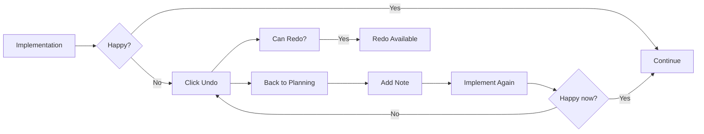

# Undo & Redo

Navigate checkpoint history to revert or reapply changes.

## What Undo Does

When you click **"Undo"**, Mehrhof:

1. **Finds previous checkpoint** - Locates the most recent checkpoint
2. **Reverts changes** - Restores files to that checkpoint state
3. **Updates task state** - Returns to the state from that checkpoint
4. **Preserves future** - Saves current state for potential redo

## What Redo Does

When you click **"Redo"**, Mehrhof:

1. **Finds next checkpoint** - Locates the checkpoint after current state
2. **Reapplies changes** - Restores files to that checkpoint state
3. **Updates task state** - Returns to the future state
4. **Updates history** - Maintains checkpoint stack

## Checkpoints

Checkpoints are automatic snapshots created at key workflow moments:

| Event                    | Checkpoint Created        |
|--------------------------|---------------------------|
| After **Planning**       | Saves specification files |
| After **Implementation** | Saves code changes        |
| After **Review**         | Saves review results      |
| Before **Finish**        | Final state before merge  |

## Using Undo

Click **"Undo"** to go back one step:

```
┌──────────────────────────────────────────────────────────────┐
│  Active Task: Add User OAuth Authentication                   │
├──────────────────────────────────────────────────────────────┤
│  State: ● Idle                                                │
│  Checkpoints: 3/5                                            │
│                                                              │
│  Quick Actions:                                              │
│    [Continue] [Undo] [Redo] [Abandon]                        │
│                                                              │
│  [Undo] ← Click this button                                  │
└──────────────────────────────────────────────────────────────┘
```

### Undo After Implementation

```
┌──────────────────────────────────────────────────────────────┐
│  Undo Checkpoint                                              │
├──────────────────────────────────────────────────────────────┤
│                                                              │
│  Current: #3 - Implementation complete                       │
│  Undo to: #2 - After planning                                │
│                                                              │
│  Changes that will be reverted:                              │
│  • internal/auth/oauth.go (created)                          │
│  • internal/auth/middleware.go (modified)                    │
│  • internal/auth/oauth_test.go (created)                     │
│  • cmd/server/main.go (modified)                             │
│                                                              │
│  This will restore files to the planning state.             │
│                                                              │
│  Current state will be saved for redo.                       │
│                                                              │
│                                [Cancel]  [Confirm Undo]      │
└──────────────────────────────────────────────────────────────┘
```

## Using Redo

After undoing, click **"Redo"** to go forward:

```
┌──────────────────────────────────────────────────────────────┐
│  Redo Checkpoint                                              │
├──────────────────────────────────────────────────────────────┤
│                                                              │
│  Current: #2 - After planning                                │
│  Redo to: #3 - Implementation complete                        │
│                                                              │
│  Changes that will be reapplied:                             │
│  • internal/auth/oauth.go (create)                           │
│  • internal/auth/middleware.go (modify)                      │
│  • internal/auth/oauth_test.go (create)                      │
│  • cmd/server/main.go (modify)                               │
│                                                              │
│                                [Cancel]  [Confirm Redo]      │
└──────────────────────────────────────────────────────────────┘
```

## Undo/Redo Workflow



## Checkpoint History

View all checkpoints in the Active Task card:

```
┌──────────────────────────────────────────────────────────────┐
│  Checkpoints (5)                                             │
├──────────────────────────────────────────────────────────────┤
│                                                              │
│  #5 • Implementation complete  ◀── Current                  │
│      Files: 3 created, 2 modified                            │
│      [View Details]                                          │
│                                                              │
│  #4 • Specifications created                                 │
│      Files: 2 specification files                            │
│      [View Details] [Restore]                                │
│                                                              │
│  #3 • Planning complete                                      │
│      Files: specification-1.md                               │
│      [View Details] [Restore]                                │
│                                                              │
│  #2 • Task started                                           │
│      Initial checkpoint                                      │
│      [View Details] [Restore]                                │
│                                                              │
│  #1 • Initial state                                          │
│      Task registered                                         │
│      [View Details] [Restore]                                │
└──────────────────────────────────────────────────────────────┘
```

Click **"Restore"** on any checkpoint to jump directly to that state.

## When to Use Undo

### Fix Implementation Issues

1. Implementation completes with bugs
2. Click **"Undo"** to revert
3. Add a note: "Fix the error handling"
4. Click **"Implement"** again

### Try Different Approach

1. Review specifications and want a different direction
2. Click **"Undo"** to go back to planning
3. Add a note with new requirements
4. Click **"Plan"** again

### Recover from Mistakes

1. Accidentally made wrong changes
2. Click **"Undo"** to revert
3. Make corrections
4. Continue

## Undo Best Practices

1. **Review before undo** - Check what will be reverted
2. **Add notes** - Explain what to fix before re-implementing
3. **Use checkpoints** - Each major step creates a checkpoint
4. **Don't undo too far** - You might lose progress
5. **Consider redo** - After undo, you can always redo

## Limitations

- **Undo before finish** - Cannot undo after task is finished
- **No partial undo** - Undo reverts entire checkpoint
- **Linear history** - Cannot branch checkpoint history

## Next Steps

After using Undo/Redo:

- [**Planning**](planning.md) - Create new specifications
- [**Implementing**](implementing.md) - Try implementation again
- [**Notes**](notes.md) - Add context for next attempt

## CLI Equivalent

```bash
# Undo last checkpoint
mehr undo

# Redo undone checkpoint
mehr redo

# View checkpoint history
mehr status

# Undo multiple steps
mehr undo --steps 2
```

See [CLI: undo](../cli/undo.md) and [CLI: redo](../cli/redo.md) for details.
