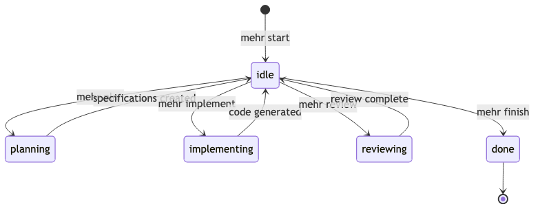

# Workflow

Mehrhof uses a state machine to manage the task lifecycle. Understanding the workflow helps you use the tool effectively.

## Task Lifecycle



## States

### Primary States

| State            | Description                       | Available Actions                                 |
| ---------------- | --------------------------------- | ------------------------------------------------- |
| **idle**         | Task registered, ready for action | plan, implement, review, finish, undo, redo      |
| **planning**     | AI creating specifications        | Wait for completion                               |
| **implementing** | AI generating code                | Wait for completion                               |
| **reviewing**    | Code review in progress           | Wait for completion                               |
| **done**         | Task completed and merged         | None (terminal)                                   |

### Auxiliary States

| State             | Description               |
| ----------------- | ------------------------- |
| **checkpointing** | Creating git checkpoint   |
| **reverting**     | Undo in progress          |
| **restoring**     | Redo in progress          |
| **failed**        | Error occurred (terminal) |

## Workflow Phases

### 1. Start Phase

Register a task and prepare the workspace:

```bash
mehr start task.md
```

What happens:

- Task ID is generated
- Git branch `task/<id>` is created
- Work directory `.mehrhof/work/<id>/` is initialized
- Source content is stored (read-only)

### 2. Planning Phase

AI analyzes requirements and creates specifications:

```bash
mehr plan
```

What happens:

- AI reads the source content and any notes
- Specifications (specification files) are generated
- Files are saved to `.mehrhof/work/<id>/specifications/`
- Git checkpoint is created for undo support

### 3. Implementation Phase

AI implements the specifications:

```bash
mehr implement
```

Requirements:

- At least one SPEC file must exist

What happens:

- AI reads all specification files and notes
- Code is generated or modified
- Changes are committed with checkpoint
- State returns to idle for review

### 4. Review Phase (Optional)

Automated code review:

```bash
mehr review
```

What happens:

- CodeRabbit analyzes the changes
- Review saved to `.mehrhof/work/<id>/reviews/`
- Issues are reported for your attention

### 5. Finish Phase

Complete and merge the task:

```bash
mehr finish
```

What happens:

- Quality checks run (if `make quality` exists)
- Changes squash-merged to target branch
- Task branch deleted
- Work directory cleaned up

## Guards

Guards are conditions that must be met for transitions:

| Guard     | Required For | Condition                       |
| --------- | ------------ | ------------------------------- |
| HasSource | start        | Task has valid source reference |
| HasSpecs  | implement    | specification files exist       |
| CanUndo   | undo         | Checkpoint history available    |
| CanRedo   | redo         | Redo stack not empty            |
| CanFinish | finish       | Task work exists                |

## Events

Events trigger state transitions:

| Event          | Description             |
| -------------- | ----------------------- |
| EventStart     | Begin task registration |
| EventPlan      | Enter planning phase    |
| EventImplement | Enter implementation    |
| EventReview    | Enter code review       |
| EventFinish    | Complete task           |
| EventUndo/Redo | Checkpoint operations   |
| EventError     | Handle errors           |
| EventAbort     | Abandon task            |

## Typical User Journey

```
1. mehr start task.md     → idle (task registered)
2. mehr plan              → planning → idle (specifications created)
3. [Review specifications, add notes with mehr note]
4. mehr implement         → implementing → idle (code generated)
5. [Review changes, maybe undo/redo]
6. mehr review            → reviewing → idle (review done)
7. mehr finish            → done (merged)
```

## Parallel Workflows

Each task runs in its own branch. You can:

- Switch between task branches
- Work on multiple tasks
- Use git worktrees for isolation

See [Tasks](concepts/tasks.md) for more on managing multiple tasks.
